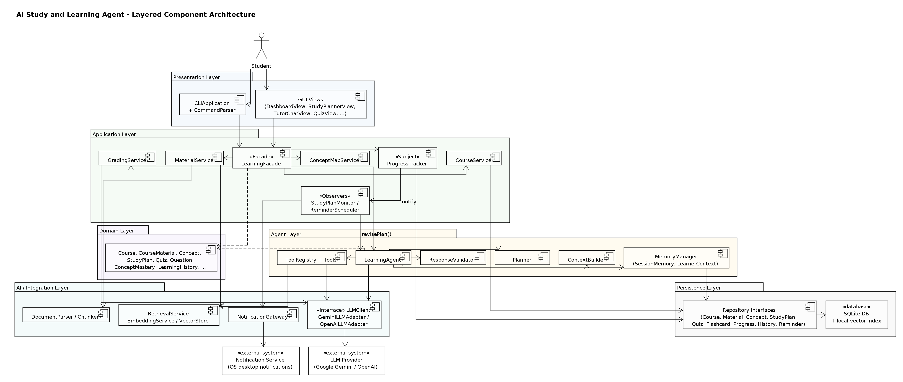
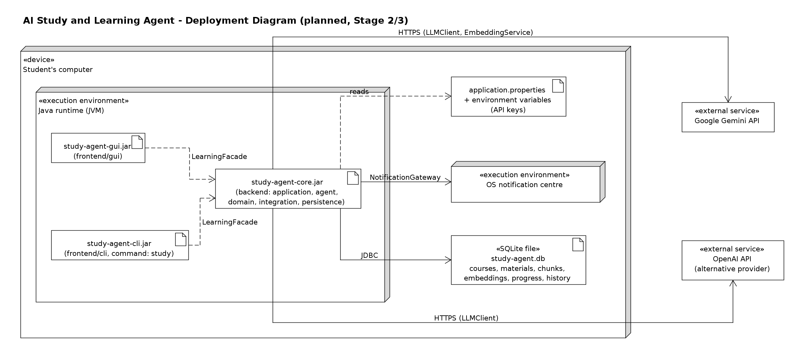

# Architecture

*AI Study and Learning Agent - EECS 3311 Fall 2026 Stage 1. Extracted from [Stage1_Report.md](Stage1_Report.md); diagrams are in [`img/`](img/) and the UMLet sources in [`../diagrams/umlet/`](../diagrams/umlet/).*

### 1.11 Overall Architecture

The system uses six logical layers - Presentation, Application, Agent, Domain, AI/Integration, Persistence - described in §3. Figure 1 gives the component-level overview.



*Figure 1. Component-level architecture (UMLet source: `docs/diagrams/umlet/00-architecture.uxf`).*

## 3. System Architecture

### 3.1 Architectural Overview

The proposed system is a single-user desktop application organised in six layers. Dependencies point downward only (a layer may use the layers below it, never above). The one deliberate exception is the Observer mechanism: the application-layer `ProgressTracker` notifies presentation-layer views, but only through the application-layer `ProgressObserver` interface, so the application layer never depends on a concrete view class.

| Layer | Responsibility | Main classes | Depends on |
|---|---|---|---|
| Presentation | Collect input, display results; no business rules | `BaseView` and 12 views, `CLIApplication`, `CommandParser`, `ParsedCommand` | Application (`LearningFacade` only) |
| Application | Use-case entry points, validation, deterministic services, persistence coordination, events | `LearningFacade`, `CourseService`, `MaterialService`, `GradingService`, `ProgressTracker`, `StudyPlanMonitor`, `ReminderScheduler`, `ConceptMapService` | Agent, Domain, Integration, Persistence |
| Agent | Goal-directed reasoning: planning, tool selection/execution, memory, prompt construction, output validation | `LearningAgent`, `Planner`, `AgentPlan`, `PlanStep`, `ToolRegistry`, `Tool` + 8 tools, `MemoryManager`, `ContextBuilder`, `ResponseValidator` | Domain, Integration, Persistence (through `MemoryManager` and tools) |
| Domain | Learning entities and their rules (mastery update, Leitner scheduling, polymorphic grading, difficulty state) | `Course`, `CourseMaterial`, `Concept`, `StudyPlan`, `Quiz`, `Question` hierarchy, `ConceptMastery`, `AdaptiveLearningSession`, ... | nothing outside the domain (except the `DifficultyState` interface it holds) |
| AI / Integration | Access to external AI services, document parsing, retrieval, notifications | `LLMClient`, `GeminiLLMAdapter`, `OpenAILLMAdapter`, `EmbeddingService`, `VectorStore`, `RetrievalService`, `DocumentParser`s, `Chunker`, `NotificationGateway` | external SDKs/services |
| Persistence | Storage abstraction for all durable data | 10 repository interfaces | storage technology (SQLite planned) |

### 3.2 Presentation Layer

Twelve GUI views inherit from the abstract `BaseView`, which holds the `LearningFacade` reference and common `render()`/`showError()` behaviour. Views only translate user actions into facade calls and display returned domain objects. The CLI consists of `CLIApplication` (entry point; `run()`, `dispatch()`, `print()`), `CommandParser` (turns `args` into a `ParsedCommand`) and the `ParsedCommand` value object. **The GUI and CLI share the same `LearningFacade`**; adding the CLI did not require any new business logic, only parsing and printing.

In MVC terms the views are the *View*, the `LearningFacade` plus application services act as the *Controller*, and domain entities are the *Model*. MVC is treated here as the architectural style of the presentation boundary rather than counted as one of the design patterns in §5.

### 3.3 Application Layer

`LearningFacade` is the single entry point for all 16 features (24 operations). It performs input validation, delegates deterministic work to services (`CourseService`, `MaterialService`, `GradingService`, `ProgressTracker`, `ReminderScheduler`, `ConceptMapService`), delegates AI work to `LearningAgent`, and coordinates persistence of results returned by the agent (for example `StudyPlanRepository.save()` after `generateStudyPlan()`). It also holds active adaptive sessions (`activeSessions`). `ProgressTracker` is the Observer subject; `StudyPlanMonitor`, `ReminderScheduler` and `ProgressDashboardView` are observers.

### 3.4 Agent Layer

`LearningAgent` exposes one public method per agent goal (study plan, revise plan, answer, summarize, extract concepts, flashcards, quiz, explanation, weak-topic diagnosis, next adaptive activity). Each method executes the agent loop using: `Planner` (creates and revises an `AgentPlan` of `PlanStep`s), `ToolRegistry` (looks up tools by name and describes them to the planner), the `Tool` implementations, `MemoryManager` (short-term `SessionMemory` and long-term learner context/history), `ContextBuilder` (assembles a token-bounded `LLMRequest`) and `ResponseValidator` (schema and grounding checks).

### 3.5 Domain Layer

Domain classes hold learning data and the deterministic rules closest to that data: `ConceptMastery.applyResult()` (mastery update), `Flashcard.recordReview()` (Leitner scheduling), `Question.grade()` (polymorphic objective grading), `QuizAttempt.computeScore()`, `StudyPlan.completionRate()`, `Reminder.isDue()`, and `AdaptiveLearningSession.recordOutcome()` (delegates to its `DifficultyState`). Ownership is modelled with composition (§4.3).

### 3.6 AI / Integration Layer

All external services sit behind interfaces: `LLMClient` (adapted for Gemini and OpenAI), `EmbeddingService`, `VectorStore`, `DocumentParser`, `NotificationGateway`. `RetrievalService` combines embedding and vector search and enforces the relevance threshold (`minScore`). The Stage 1 design is deliberately implementation-independent about the vector store; for a single student's materials a local index (embeddings stored alongside chunks in SQLite with cosine-similarity search) is sufficient, and a dedicated vector database could replace it behind the same interface.

### 3.7 Persistence Layer

Ten repository interfaces (`StudentRepository`, `CourseRepository`, `MaterialRepository`, `ConceptRepository`, `StudyPlanRepository`, `QuizRepository`, `FlashcardRepository`, `ProgressRepository`, `LearningHistoryRepository`, `ReminderRepository`) define all storage operations. Upper layers depend only on these interfaces; concrete SQLite implementations will be added in Stage 2 and are therefore not shown in the specification-level class diagram.

### 3.8 Agent Workflow

```
 Observe        MemoryManager.loadLearnerContext() / getSessionMemory()
   |
 Plan           Planner.createPlan(goal, ctx) -> AgentPlan[PlanStep...]
   |
 Act (loop)     ToolRegistry.getTool(step.toolName).execute(step.input) -> ToolResult
   |               |-- failure/empty result --> Planner.revise(plan, observation)
 Generate       ContextBuilder.build(task, ctx) -> LLMClient.generate[Structured]()
   |
 Evaluate       ResponseValidator.validate() / checkGrounding()  -- invalid -> retry or fallback
   |
 Remember       MemoryManager.recordEvent(), appendToSession(); ProgressTracker updates mastery
   |
 Adapt          DifficultyState transitions; StudyPlanMonitor -> LearningAgent.revisePlan()
```

### 3.9 Deployment View

The system will be deployed as a single-user desktop application. The backend core and the two front ends run in the same Java runtime on the student's computer; data is stored locally in one SQLite file; the only network traffic is to the configured AI provider. The repository mirrors this structure (`backend/`, `frontend/gui/`, `frontend/cli/`, `deployment/`; see Appendix A).



*Figure 2. Planned deployment (`14-deployment.uxf`).*

## 10. AI Agent Design

### 10.1 Agent Reasoning

Reasoning is divided between the LLM and deterministic code so that every decision is either *explainable by a rule* or *checked by a rule*:

| Decision | Made by | Checked/constrained by |
|---|---|---|
| Which tools a goal needs (plan) | `Planner` - templates for known goals; LLM tool choice for open requests | Plan steps must name registered tools (`ToolRegistry.getTool()`) |
| Whether material is relevant | `RetrievalService` threshold (deterministic) | - |
| Which concepts are weak | `ProgressAnalysisTool` (deterministic formula) | - |
| Why a concept is weak (misconception) | LLM | `ResponseValidator` schema; only for concepts already flagged weak |
| Topic priorities and objectives for a plan | LLM | Schema validation; fallback to deterministic priorities |
| How time is allocated | `StudyPlanningStrategy` (deterministic) | Daily-minute and exam-date constraints |
| Next difficulty level | `DifficultyState` (deterministic) | - |
| Content of questions, cards, summaries, answers, explanations | LLM | Factory validation, schema validation, grounding check |
| Whether a plan must be revised | `StudyPlanMonitor.needsRevision()` (deterministic threshold) | - |

### 10.2 Planning

`Planner.createPlan(goal, ctx)` returns an `AgentPlan`, an ordered list of `PlanStep`s (`toolName`, `input`, `rationale`, `status`). For the ten goal types the plans are templates parameterised by context (e.g. a study plan always includes analysis, retrieval, prioritisation and scheduling, and adds the reminder step only if reminders are enabled; summarisation uses map-reduce only when the chunks exceed the token budget). For free-form requests in the tutor chat (e.g. "make me something to practise inheritance tonight"), the planner gives the LLM the tool descriptions from `ToolRegistry.describeTools()` and asks it to choose steps; the resulting plan is validated against the registry. `Planner.revise(plan, observation)` handles failures such as empty retrieval or invalid output by replacing, skipping or re-parameterising steps.

### 10.3 Tool Use

| Tool | Deterministic / AI | Used by goals |
|---|---|---|
| `RetrievalTool` | Deterministic (embedding search) | Q&A, plan, quiz, flashcards, explanation, diagnosis, adaptive |
| `ProgressAnalysisTool` | Deterministic | Plan, weak topics, adaptive |
| `StudyScheduleTool` | Deterministic (Strategy) | Plan |
| `ReminderTool` | Deterministic | Plan |
| `SummarizationTool` | AI | Summarize |
| `ConceptExtractionTool` | AI | Extract concepts |
| `QuizGenerationTool` | AI + Factory Method validation | Quiz, adaptive |
| `FlashcardGenerationTool` | AI | Flashcards |

The agent never calls an AI tool for something a deterministic tool can compute, and every AI tool's output passes through deterministic validation before it becomes a domain object.

### 10.4 Retrieval

Uploaded files are parsed, split into overlapping chunks (≈800 tokens, 100 overlap, keeping page references), embedded and stored. At query time `RetrievalService.retrieve(query, courseId, k)` embeds the query, searches only the course's vectors, discards results below `minScore` (initially 0.55, to be calibrated in Stage 2) and returns `RetrievedChunk`s with scores. `ContextBuilder.rankAndTrim()` fits the best chunks into the token budget and numbers them so the LLM can cite `[n]`; `ResponseValidator.checkGrounding()` verifies that cited numbers exist.

### 10.5 Memory

| Memory | Class | Content | Lifetime | Used for |
|---|---|---|---|---|
| Short-term session context | `SessionMemory` | Last 20 conversation turns | One chat session | Follow-up questions |
| Learner context | `LearnerContext` (built by `MemoryManager`) | Profile, concept masteries, recent events, exam date | Built per request | Planning, prioritisation, difficulty |
| Concept mastery | `ConceptMastery` | Mastery 0-1, attempts, last practised | Persistent | Weak topics, adaptation, concept map |
| Performance history | `PerformanceRecord` | Each graded result with difficulty and source | Persistent | Diagnosis, trends |
| Long-term learning history | `LearningHistory` / `LearningEvent` | Every significant activity | Persistent | History view, context |
| Course/material context | `CourseMaterial`, `DocumentChunk`, vectors | Course content | Persistent | Retrieval |

### 10.6 Adaptation

Adaptation happens at three time-scales: **per activity** (difficulty `State` transitions, next-concept selection), **per result** (mastery update and Observer notifications that create reminders), and **per plan** (`StudyPlanMonitor` asks `LearningAgent.revisePlan()` to re-run prioritisation and scheduling for the remaining days when a planned concept falls below the mastery threshold).

### 10.7 Why this is an agent and not a chatbot

A chatbot maps one prompt to one response. Here, a single student request leads to a *plan* of several steps, *tool calls* that read and write system state, *checks* that can reject the model's output, *memory* that persists across sessions, and *autonomous follow-up actions* (plan revision, reminders) triggered by later events - none of which depend on the student re-prompting.
