# AI Study and Learning Agent - Stage 1 Project Design Report

| | |
|---|---|
| **Course** | EECS 3311 - Software Design, Fall 2026 |
| **Project** | AI Study and Learning Agent |
| **Student** | Nazanin Fatemeh Soleimani |
| **Student ID** | 222050579 |
| **Repository** | <https://github.com/Nazaninsoleimani/EECS3311.git> |
| **Stage** | Stage 1 - Project Definition and UML Design (no implementation) |

All UML diagrams in this report were created in **UMLet 15.1**. The editable UMLet files (`.uxf`) are stored in [`docs/diagrams/umlet/`](../diagrams/umlet/), and every figure below is an export of one of those files. All class-diagram views are built from the same class model, so every view shows the same classes, methods and relationships.

---

## Table of Contents

1. Project Overview
2. Functional Features
3. System Architecture
4. UML Class Diagram
5. Design Patterns
6. Use-Case Model
7. Sequence Diagrams
8. Feature-to-Design Traceability
9. Feature Implementation / Realization
10. AI Agent Design
11. Non-Functional Design Considerations
12. Consistency and Completeness Audit
13. Conclusion

Appendix A - Repository Structure
Appendix B - CLI Command Reference
Appendix C - Complete Class Diagram

---

## 1. Project Overview

### 1.1 Project Title

**AI Study and Learning Agent** - a personalized, course-aware AI learning agent for university students.

### 1.2 Student Information

Nazanin Fatemeh Soleimani (222050579), EECS 3311, Fall 2026. The same GitHub repository (<https://github.com/Nazaninsoleimani/EECS3311.git>) will be used for Stages 1, 2 and 3.

### 1.3 Problem and Motivation

University students receive large amounts of course material (lecture slides, notes, readings, lab handouts) but have little support for turning that material into an effective study process. Typical problems are:

- Students do not know **what to study first**. Time before an exam is limited and is often spent re-reading material they already understand.
- Generic AI chatbots answer questions **without reference to the student's actual course**, so answers may use different notation, cover topics outside the syllabus, or be confidently wrong with no source to check.
- Practice material (quizzes, flashcards) is time-consuming to produce, and is rarely matched to the student's **current level**.
- Students have no reliable record of **which concepts they have mastered** and which remain weak, so study plans are not revised when performance changes.

The proposed system will address these problems with an AI agent that works over the student's own uploaded course materials, keeps a model of the student's concept mastery, plans study time, generates and grades practice, and adapts future activities to measured performance.

### 1.4 Target Users

The primary users are **undergraduate and graduate students** who study from digital course material (PDF, DOCX, plain-text or Markdown notes). A typical user is an EECS student preparing for a midterm or final exam in a course such as EECS 2030, who has the lecture slides and wants a plan, practice questions and explanations grounded in those slides. The system is a single-user personal study tool; it does not include instructor or administrator roles (see §6.1).

### 1.5 Project Goals

1. Provide grounded, source-cited answers and summaries derived from the student's own course material.
2. Generate personalized multi-day study plans that prioritise weak concepts and respect the student's available time and exam date.
3. Generate practice material (quizzes, flashcards) and grade it, deterministically wherever the answer is objective.
4. Maintain a persistent, explainable model of concept mastery and use it to adapt difficulty and revise plans.
5. Expose all major functionality through **both a GUI and a CLI** that share the same application services.
6. Keep the design modular enough that the LLM provider, storage technology and planning strategies can change without redesign.

### 1.6 Why an AI Agent?

A simple "send a prompt to an LLM" application cannot solve the problem, because the useful behaviour requires **multi-step decisions over private data and state**:

- To answer a question correctly the system must first **retrieve** the relevant passages from the student's materials, then generate an answer constrained to those passages, then **check** that the answer is actually grounded.
- To build a study plan it must **observe** the student's mastery history, **decide** which concepts are weak, **retrieve** relevant material, **reason** about priorities, **select** a scheduling strategy, and **act** (save the plan, schedule reminders).
- To adapt learning it must **evaluate** results, update its memory, change its difficulty state and choose the next activity.

These are the defining properties of an agent: a goal, a plan, tool use, memory, and adaptation based on observations. The LLM provides language understanding and generation; deterministic software provides state, validation, grading, scheduling and persistence (§10, §11).

### 1.7 AI / LLM Model

- **Primary model:** Google **Gemini** (a Flash-class model accessed through the Gemini API), chosen for its large context window, structured JSON output support and low cost per request, which suits frequent quiz/flashcard generation.
- **Alternative model:** an **OpenAI GPT** model through the OpenAI API.
- **Embeddings:** a text-embedding model from the configured provider, used only for semantic retrieval.
- **Provider independence:** all model access goes through the `LLMClient` interface. `GeminiLLMAdapter` and `OpenAILLMAdapter` adapt each vendor SDK to that interface (Adapter pattern, §5.5). The concrete adapter and model name are configuration values, so the model can be replaced without changing the agent, tools or services.

### 1.8 Agent Behaviour

The `LearningAgent` follows an explicit loop for every goal (detailed in §3.8 and §10):

**Observe** (load learner context and session memory) → **Plan** (`Planner.createPlan()` produces an `AgentPlan` of tool steps) → **Act** (execute each step through a `Tool` obtained from the `ToolRegistry`) → **Generate** (build a bounded prompt with `ContextBuilder` and call the `LLMClient`) → **Evaluate** (`ResponseValidator` checks schema validity and grounding; the plan is revised on failure) → **Remember** (`MemoryManager.recordEvent()`, mastery updates) → **Adapt** (difficulty `State` transitions, study-plan revision triggered by the `Observer` mechanism).

### 1.9 GUI

The GUI is a desktop course dashboard with the following views (each a subclass of `BaseView`): **Dashboard**, **Courses**, **Course Materials** (upload, summaries, extracted concepts), **Study Planner**, **AI Tutor Chat**, **Quiz Center**, **Flashcards**, **Adaptive Learning Session**, **Progress Dashboard** (including Weak Topics), **Concept Map**, **Reminders**, and **Learning History**.

### 1.10 CLI

The CLI (`CLIApplication` + `CommandParser`) exposes the same functionality as commands of the form `study <group> <action> [options]`, for example `study course create`, `study material upload`, `study ask`, `study study-plan generate`, `study quiz generate`, `study quiz take`, `study weak-topics show`, `study learning-session start` and `study history show`. The complete command list is in Appendix B. The CLI calls the same `LearningFacade` methods as the GUI, so there is no duplicated business logic.

### 1.11 Overall Architecture

The system uses six logical layers - Presentation, Application, Agent, Domain, AI/Integration, Persistence - described in §3. Figure 1 gives the component-level overview.


*Figure 1. Component-level architecture (UMLet source: `docs/diagrams/umlet/00-architecture.uxf`).*

---

## 2. Functional Features

### 2.1 Feature Overview

The system provides **16 features**. Trivial operations (login, exit, about, settings) are not counted. Each feature belongs to one integrated learning loop: *materials → understanding → planning → practice → assessment → adaptation → tracking*.

| ID | Feature | Type | Use Case | Sequence Diagram |
|---|---|---|---|---|
| F01 | Course Management | Deterministic | UC01 | SD11 |
| F02 | Learning Material Upload and Management | Deterministic | UC02 | SD07 |
| F03 | Document Summarization | AI-based | UC03 | SD05 |
| F04 | Concept Extraction | AI-based | UC04 | SD07 |
| F05 | Question Answering over Course Materials | Hybrid | UC05 | SD02 |
| F06 | Personalized Study-Plan Generation | Hybrid | UC06 | SD01, SD04 |
| F07 | Flashcard Generation and Review | Hybrid | UC07 | SD08 |
| F08 | Quiz Generation | AI-based | UC08 | SD03 |
| F09 | Automatic Quiz Grading | Hybrid | UC09 | SD03 |
| F10 | Answer Explanation | AI-based | UC10 | SD03 |
| F11 | Weak-Topic Identification | Hybrid | UC11 | SD06, SD01 |
| F12 | Adaptive Question Difficulty | Hybrid | UC12 | SD04 |
| F13 | Learning Progress Tracking | Deterministic | UC13 | SD06, SD03, SD04 |
| F14 | Study Reminder Management | Deterministic | UC14 | SD09 |
| F15 | Concept Relationship Visualization | Hybrid | UC15 | SD10 |
| F16 | Learning Session History | Deterministic | UC16 | SD11 |

**Classification rules used.** *Deterministic*: no LLM call; behaviour is fully defined by code. *AI-based*: the essential output is generated by the LLM, with deterministic validation around it. *Hybrid*: the feature's result depends on both a deterministic computation that the system controls (retrieval, scoring, scheduling, state transitions) and LLM reasoning/generation.

### 2.2 Detailed Feature Specifications
#### F01 - Course Management

| Field | Specification |
|---|---|
| **Type** | Deterministic |
| **Description** | Create, view, edit and delete courses (code, title, exam date). A course is the container for materials, concepts, plans, quizzes and flashcard decks. |
| **Purpose** | Every AI operation is scoped to a course so that retrieval, mastery and planning use only that course's data. |
| **User interaction (GUI)** | *Courses* view: "New Course" form; edit/delete actions on each course card. |
| **CLI access** | `study course create --code EECS2030 --title "Advanced OOP" --exam 2026-12-12`; `study course list`; `study course update`; `study course delete <courseId>` |
| **Inputs** | Course code, title, optional exam date. |
| **Outputs** | Persisted `Course`; updated course list. |
| **AI involvement** | None. |
| **Expected workflow** | `CourseView.createCourse()` → `LearningFacade.createCourse()` → `CourseService.createCourse()` validates uniqueness and date → `Course` created → `CourseRepository.save()` → `MemoryManager.recordEvent(COURSE_CREATED)`. |
| **Error / alternative cases** | Duplicate course code for the same student → rejected with message. Exam date in the past → rejected. Delete of a course with materials → confirmation required; deletion cascades (composition) to materials, chunks, concepts, plans, quizzes and decks, and removes vectors via `RetrievalService.removeMaterial()`. |
| **Preconditions** | Student profile exists. |
| **Postconditions** | Course stored and visible in GUI and CLI. |
| **Related use case** | UC01 Manage Courses |
| **Related classes** | `CourseView`, `CLIApplication`, `LearningFacade`, `CourseService`, `Course`, `CourseRepository`, `MemoryManager` |
| **Important methods** | `createCourse()`, `updateCourse()`, `deleteCourse()`, `listCourses()`, `CourseRepository.save()/findByStudent()` |
| **Sequence diagram** | SD11 |
| **Design patterns** | Facade |

#### F02 - Learning Material Upload and Management

| Field | Specification |
|---|---|
| **Type** | Deterministic (the embedding model is used as a fixed function; no LLM reasoning) |
| **Description** | Upload PDF, DOCX, TXT or Markdown files to a course; the system extracts text, splits it into chunks, embeds and indexes them for retrieval, and tracks processing status. Materials can be listed and deleted. |
| **Purpose** | Provides the grounding data that Q&A, summaries, quizzes, flashcards and plans depend on. |
| **User interaction (GUI)** | *Course Materials* view: "Upload" button (file chooser), status badge (Uploaded / Indexed / Failed), delete action. |
| **CLI access** | `study material upload --course EECS2030 ./week5.pdf`; `study material list --course EECS2030`; `study material delete <materialId>` |
| **Inputs** | Course ID, file path. |
| **Outputs** | `CourseMaterial` with status `INDEXED`, its `DocumentChunk`s, and vectors in the `VectorStore`. |
| **AI involvement** | Embeddings only (computed by `EmbeddingService`). Concept extraction (F04) is triggered afterwards as an included use case. |
| **Expected workflow** | `MaterialService.upload()` → `findParser()` (asks each `DocumentParser.supports()`) → `parse()` → `Chunker.chunk()` (800-token chunks, 100-token overlap) → `RetrievalService.index()` → `EmbeddingService.embed()` → `VectorStore.upsert()` → `CourseMaterial.markIndexed()` → `MaterialRepository.save()`. |
| **Error / alternative cases** | Unsupported type (e.g. `.pptx`, image) → `UnsupportedFileTypeError`, nothing stored. Empty/corrupted/scanned file without text → material saved with status `FAILED` via `markFailed(reason)` and the user is told to upload a text-based version. Embedding service unavailable → status remains `UPLOADED`, indexing retried later. |
| **Preconditions** | Course exists. |
| **Postconditions** | Material is retrievable by semantic search and listed under the course. |
| **Related use case** | UC02 Upload Learning Material (includes UC04) |
| **Related classes** | `MaterialView`, `LearningFacade`, `MaterialService`, `DocumentParser` (`PdfParser`, `DocxParser`, `PlainTextParser`), `Chunker`, `RetrievalService`, `EmbeddingService`, `VectorStore`, `CourseMaterial`, `DocumentChunk`, `MaterialRepository` |
| **Important methods** | `uploadMaterial()`, `upload()`, `findParser()`, `supports()`, `parse()`, `chunk()`, `index()`, `embed()`, `upsert()`, `markIndexed()`, `markFailed()` |
| **Sequence diagram** | SD07 |
| **Design patterns** | Facade; parsers are interchangeable implementations of `DocumentParser` |

#### F03 - Document Summarization

| Field | Specification |
|---|---|
| **Type** | AI-based |
| **Description** | Produces a brief, standard or detailed summary of an uploaded material with key points and page references. |
| **Purpose** | Gives a fast overview of a lecture before deeper study, and a revision sheet before an exam. |
| **User interaction (GUI)** | *Course Materials* view: select a material → "Summarize" → choose length → summary panel. |
| **CLI access** | `study material summarize <materialId> --length detailed` |
| **Inputs** | Material ID, `SummaryOptions` (length). |
| **Outputs** | `Summary` (text, key points, source page references), stored with the material. |
| **AI involvement** | The LLM writes the summary. The `Planner` decides between a single pass and a map-reduce plan depending on whether the chunks fit the token budget. |
| **Expected workflow** | `summarizeMaterial()` → `MaterialRepository.findById()` and `findChunks()` → `LearningAgent.summarize()` → `Planner.createPlan()` → `SummarizationTool.execute()` (map: `LLMClient.generate()` per chunk group; reduce: one combining call) → `ResponseValidator.validate()` → `Summary` created → `MaterialRepository.saveSummary()`. |
| **Error / alternative cases** | Material not found; material not `INDEXED` (unsupported/failed extraction) → error explaining how to fix; LLM error/timeout → "summary unavailable, retry later", no partial summary stored; invalid output → one retry. |
| **Preconditions** | Material exists with status `INDEXED`. |
| **Postconditions** | Summary stored (0..1 per material, replaced on regeneration); `MATERIAL_SUMMARIZED` event recorded. |
| **Related use case** | UC03 Summarize Material |
| **Related classes** | `MaterialView`, `LearningFacade`, `MaterialRepository`, `LearningAgent`, `Planner`, `ToolRegistry`, `SummarizationTool`, `LLMClient`, `ResponseValidator`, `Summary`, `MemoryManager` |
| **Important methods** | `summarizeMaterial()`, `summarize()`, `createPlan()`, `getTool()`, `execute()`, `generate()`, `validate()`, `saveSummary()` |
| **Sequence diagram** | SD05 |
| **Design patterns** | Facade, Adapter |

#### F04 - Concept Extraction

| Field | Specification |
|---|---|
| **Type** | AI-based (with deterministic validation and de-duplication) |
| **Description** | Identifies the key concepts in a material (name, short definition) and the relations between them (`PREREQUISITE_OF`, `PART_OF`, `RELATED_TO`). Runs automatically after upload and can be re-run on demand. |
| **Purpose** | Concepts are the unit of mastery tracking, quiz targeting, weak-topic analysis and the concept map; without them the system could not personalise. |
| **User interaction (GUI)** | Automatic after upload; "Re-extract concepts" action on a material; extracted concepts listed under the material. |
| **CLI access** | `study material extract-concepts <materialId>` |
| **Inputs** | Material ID (its chunks). |
| **Outputs** | `ConceptGraph` (concepts + relations), persisted per course. |
| **AI involvement** | The LLM extracts concepts and proposes relations as structured JSON. |
| **Expected workflow** | `LearningAgent.extractConcepts()` → `ConceptExtractionTool.execute()` → `LLMClient.generateStructured()` per chunk batch → `ResponseValidator.validate()` → `ConceptGraph` created → `ConceptRepository.saveAll()` (merges by normalised name) and `saveRelations()`. |
| **Error / alternative cases** | LLM unavailable or output invalid → empty graph + warning; the material remains usable for Q&A and summaries, and extraction can be retried. Relations referencing unknown concepts are dropped by validation. |
| **Preconditions** | Material is `INDEXED`. |
| **Postconditions** | Course concept set and relation set updated without duplicates. |
| **Related use case** | UC04 Extract Concepts (included by UC02) |
| **Related classes** | `LearningFacade`, `LearningAgent`, `ConceptExtractionTool`, `LLMClient`, `ResponseValidator`, `Concept`, `ConceptRelation`, `ConceptGraph`, `ConceptRepository` |
| **Important methods** | `extractConcepts()`, `execute()`, `generateStructured()`, `validate()`, `saveAll()`, `saveRelations()` |
| **Sequence diagram** | SD07 |
| **Design patterns** | Facade, Adapter |

#### F05 - Question Answering over Course Materials

| Field | Specification |
|---|---|
| **Type** | Hybrid (deterministic retrieval and grounding check; LLM answer generation) |
| **Description** | The student asks natural-language questions; the agent retrieves relevant chunks, answers only from them, and cites the sources (material + page). Follow-up questions use short-term session memory. |
| **Purpose** | Trustworthy tutoring aligned with the student's own course notation and scope. |
| **User interaction (GUI)** | *AI Tutor* chat view; citations are clickable and open the source page. |
| **CLI access** | `study ask --course EECS2030 "Why can't a subclass reduce method visibility?"` (an interactive `study ask --course EECS2030 -i` mode keeps session memory). |
| **Inputs** | Session ID, course ID, question text. |
| **Outputs** | `Answer` (text, citations, `grounded` flag). |
| **AI involvement** | The `Planner` decides that retrieval is required; the LLM writes the answer constrained to retrieved sources. |
| **Expected workflow** | See SD02: session memory → plan → `RetrievalTool` → `RetrievalService.retrieve()` (embed + vector search, threshold `minScore`) → `ContextBuilder.build()` → `LLMClient.generate()` → `ResponseValidator.checkGrounding()` → `Answer` → `appendToSession()` and `recordEvent()`. |
| **Error / alternative cases** | No chunk above threshold → the agent does **not** call the LLM; it returns an ungrounded notice and offers to upload material or give a clearly labelled general explanation. Grounding check fails → one stricter regeneration; if still failing, the answer is returned with `grounded=false` and a warning. LLM unavailable → error message, question preserved in the chat box. |
| **Preconditions** | Course has at least one `INDEXED` material (otherwise the "not found" path is taken). |
| **Postconditions** | Conversation turn stored in `SessionMemory`; `QUESTION_ASKED` event in history. |
| **Related use case** | UC05 Ask Questions about Material (includes UC17) |
| **Related classes** | `TutorChatView`, `LearningFacade`, `LearningAgent`, `MemoryManager`, `SessionMemory`, `Planner`, `ToolRegistry`, `RetrievalTool`, `RetrievalService`, `EmbeddingService`, `VectorStore`, `ContextBuilder`, `LLMClient`, `ResponseValidator`, `Answer`, `LearningHistoryRepository` |
| **Important methods** | `askQuestion()`, `answerQuestion()`, `getSessionMemory()`, `recent()`, `retrieve()`, `search()`, `build()`, `generate()`, `checkGrounding()`, `appendToSession()` |
| **Sequence diagram** | SD02 |
| **Design patterns** | Facade, Adapter |

#### F06 - Personalized Study-Plan Generation

| Field | Specification |
|---|---|
| **Type** | Hybrid |
| **Description** | Generates a day-by-day study plan up to the exam date, prioritising weak concepts, fitting the student's daily time, and attaching a learning activity (read, flashcards, quiz, adaptive session) and objective to each task. The plan is automatically revised when mastery changes significantly. |
| **Purpose** | Answers "what should I study, and when?" - the central value of the agent. |
| **User interaction (GUI)** | *Study Planner* view: form (exam date, minutes/day, focus topics) → "Generate Plan"; calendar/list of tasks; tick tasks complete. |
| **CLI access** | `study study-plan generate --course EECS2030 --exam 2026-12-12 --minutes 90 --focus inheritance,polymorphism`; `study study-plan show`; `study study-plan done <taskId>` |
| **Inputs** | `StudyPlanRequest` (student, course, exam date, daily minutes, focus topics). |
| **Outputs** | `StudyPlan` with `StudyTask`s, chosen strategy name and an explanation (rationale); optional reminders. |
| **AI involvement** | LLM reasons over weak topics, retrieved material and focus topics to produce topic priorities, learning objectives and the rationale. Deterministic code computes mastery-based ranking, chooses the scheduling strategy and allocates time slots. |
| **Expected workflow** | SD01: validate → load learner context → `Planner.createPlan()` → `ProgressAnalysisTool` (weak topics) → `RetrievalTool` → `ContextBuilder.build()` → `LLMClient.generateStructured()` → `ResponseValidator.validate()` → `StudyScheduleTool.selectStrategy()` → `StudyPlanningStrategy.buildSchedule()` → `StudyPlan` → optional `ReminderTool` → `StudyPlanRepository.save()`. Revision: SD04 (`StudyPlanMonitor` → `LearningAgent.revisePlan()`). |
| **Error / alternative cases** | Exam date in the past / non-positive minutes → validation error. No relevant material → plan generated in "ungrounded" mode from concept names with a visible warning. Invalid LLM output after two attempts → deterministic priorities used. Not enough days for all topics → lowest-priority topics listed as "not scheduled". |
| **Preconditions** | Course exists; (recommended) materials uploaded. |
| **Postconditions** | One active `StudyPlan` per course (previous plan archived); `PLAN_GENERATED` event; reminders scheduled if enabled. |
| **Related use case** | UC06 Generate Study Plan (includes UC11, UC17) |
| **Related classes** | `StudyPlannerView`, `LearningFacade`, `LearningAgent`, `MemoryManager`, `Planner`, `ToolRegistry`, `ProgressAnalysisTool`, `RetrievalTool`, `ContextBuilder`, `LLMClient`, `ResponseValidator`, `StudyScheduleTool`, `StudyPlanningStrategy` (+3 strategies), `ReminderTool`, `StudyPlan`, `StudyTask`, `StudyPlanRepository`, `StudyPlanMonitor` |
| **Important methods** | `generateStudyPlan()`, `loadLearnerContext()`, `createPlan()`, `execute()`, `rankTopics()`, `generateStructured()`, `selectStrategy()`, `buildSchedule()`, `revisePlan()`, `completeStudyTask()` |
| **Sequence diagram** | SD01 (generation), SD04 (revision) |
| **Design patterns** | Strategy, Facade, Observer (revision), Adapter |

#### F07 - Flashcard Generation and Review

| Field | Specification |
|---|---|
| **Type** | Hybrid (AI generation; deterministic spaced-repetition review) |
| **Description** | Generates a deck of question/answer flashcards for selected topics from course material, then schedules reviews with a Leitner spaced-repetition rule. |
| **Purpose** | Active recall practice for definitions and facts, with reviews spaced to improve retention. |
| **User interaction (GUI)** | *Flashcards* view: choose topics/count → "Generate"; review mode with flip and Again/Hard/Good/Easy rating. |
| **CLI access** | `study flashcards generate --course EECS2030 --topic polymorphism --count 15`; `study flashcards review --course EECS2030` |
| **Inputs** | `FlashcardRequest` (course, topics/concepts, count); review rating. |
| **Outputs** | `FlashcardDeck` of `Flashcard`s; updated box and next-review date per card. |
| **AI involvement** | LLM writes front/back pairs from retrieved material. Review scheduling is deterministic (`Flashcard.recordReview()`: Good/Easy → box+1, Again/Hard → box 1; intervals 1, 2, 4, 8, 16 days). |
| **Expected workflow** | SD08: CLI `parse()` → `dispatch()` → `generateFlashcards()` → `RetrievalTool` → `ContextBuilder.build()` → `FlashcardGenerationTool.execute()` → `generateStructured()` → `validate()` (drop empty/duplicate cards) → `FlashcardDeck` → `FlashcardRepository.saveDeck()`. Review: `reviewFlashcard()` → `findCard()` → `recordReview()` → `saveCard()` → `ProgressTracker.recordResult()`. |
| **Error / alternative cases** | Unknown CLI command/missing option → usage help. No material on topic → error. Fewer valid cards than requested → deck created with the valid ones and the shortfall reported. |
| **Preconditions** | Course with indexed material. |
| **Postconditions** | Deck stored; review outcomes feed concept mastery. |
| **Related use case** | UC07 Generate and Review Flashcards (includes UC17) |
| **Related classes** | `CLIApplication`, `CommandParser`, `FlashcardView`, `LearningFacade`, `LearningAgent`, `RetrievalTool`, `ContextBuilder`, `FlashcardGenerationTool`, `LLMClient`, `ResponseValidator`, `FlashcardDeck`, `Flashcard`, `FlashcardRepository`, `ProgressTracker` |
| **Important methods** | `run()`, `parse()`, `dispatch()`, `generateFlashcards()`, `execute()`, `generateStructured()`, `saveDeck()`, `reviewFlashcard()`, `recordReview()`, `recordResult()` |
| **Sequence diagram** | SD08 |
| **Design patterns** | Facade, Adapter |

#### F08 - Quiz Generation

| Field | Specification |
|---|---|
| **Type** | AI-based |
| **Description** | Generates quizzes of multiple-choice, true/false and short-answer questions on chosen concepts and difficulty, grounded in course material. |
| **Purpose** | Unlimited, syllabus-aligned self-assessment. |
| **User interaction (GUI)** | *Quiz Center*: choose concepts, number of questions, types, difficulty → "Generate Quiz". |
| **CLI access** | `study quiz generate --course EECS2030 --concepts inheritance --count 10 --types mcq,tf,short --difficulty intermediate` |
| **Inputs** | `QuizRequest` (course, concept IDs, count, question types, difficulty). |
| **Outputs** | `Quiz` containing `Question` objects of the correct subclasses. |
| **AI involvement** | LLM produces `QuestionSpec` JSON; deterministic factories validate and instantiate questions. |
| **Expected workflow** | SD03 Part A: `generateQuiz()` → `RetrievalTool` → `ContextBuilder.build()` → `QuizGenerationTool.execute()` → `LLMClient.generateStructured()` → for each spec `QuestionFactory.build()` → `createQuestion()` → `Quiz` → `QuizRepository.save()`. |
| **Error / alternative cases** | Invalid specs (bad option index, empty prompt, unknown concept) are rejected by the factory; the tool requests replacements (max two rounds). If still short, the quiz is created with fewer questions and the student is informed. |
| **Preconditions** | Course has concepts and indexed material. |
| **Postconditions** | Quiz stored and ready to take. |
| **Related use case** | UC08 Generate Quiz (includes UC17) |
| **Related classes** | `QuizView`, `LearningFacade`, `LearningAgent`, `RetrievalTool`, `ContextBuilder`, `QuizGenerationTool`, `LLMClient`, `QuestionFactory` (+3 factories), `Question` (+3 subclasses), `Quiz`, `QuizRepository` |
| **Important methods** | `generateQuiz()`, `execute()`, `generateStructured()`, `build()`, `createQuestion()`, `save()` |
| **Sequence diagram** | SD03 |
| **Design patterns** | Factory Method, Facade, Adapter |

#### F09 - Automatic Quiz Grading

| Field | Specification |
|---|---|
| **Type** | Hybrid (deterministic for objective questions; rubric-based LLM scoring for short answers) |
| **Description** | Grades a submitted quiz, produces per-question results and an overall score, and records performance evidence for each concept. |
| **Purpose** | Immediate, consistent feedback, and the data source for mastery tracking and adaptation. |
| **User interaction (GUI)** | *Quiz Center*: answer questions → "Submit" → results screen. |
| **CLI access** | `study quiz take <quizId>` (interactive; answers are graded on completion). |
| **Inputs** | Quiz ID, list of `QuestionResponse`. |
| **Outputs** | `QuizAttempt` with `GradeResult`s and derived score; updated `ConceptMastery`. |
| **AI involvement** | Only for `ShortAnswerQuestion`: LLM scores against the stored model answer and rubric. Multiple-choice and true/false grading is exact and deterministic. |
| **Expected workflow** | SD03 Part B: `submitQuiz()` → `findById()` → `GradingService.grade()` → per question `gradeResponse()` → `Question.grade()` (objective) or `gradeWithRubric()` → `QuizAttempt` → `computeScore()` → `saveAttempt()` → `ProgressTracker.recordAttempt()` → `savePerformance()`, `ConceptMastery.applyResult()`, `saveMastery()`, `notifyObservers()`. |
| **Error / alternative cases** | Unanswered question → scored 0. LLM unavailable for short answers → those results flagged "needs review" and excluded from mastery updates. |
| **Preconditions** | Quiz exists; student has answered. |
| **Postconditions** | Attempt stored; mastery and performance records updated; observers notified. |
| **Related use case** | UC09 Take and Grade Quiz |
| **Related classes** | `QuizView`, `LearningFacade`, `QuizRepository`, `GradingService`, `Question` and subclasses, `QuizAttempt`, `GradeResult`, `ProgressTracker`, `ProgressRepository`, `ConceptMastery`, `PerformanceRecord`, `ProgressDashboardView` |
| **Important methods** | `submitQuiz()`, `grade()`, `gradeResponse()`, `Question.grade()`, `isObjective()`, `gradeWithRubric()`, `computeScore()`, `recordAttempt()`, `applyResult()`, `notifyObservers()` |
| **Sequence diagram** | SD03 |
| **Design patterns** | Observer, Facade (polymorphic `grade()` relies on the Factory Method product hierarchy) |

#### F10 - Answer Explanation

| Field | Specification |
|---|---|
| **Type** | AI-based |
| **Description** | After grading, explains why the correct answer is correct and why the student's answer was wrong, with a reference to the course material. |
| **Purpose** | Turns a mistake into learning instead of just a score. |
| **User interaction (GUI)** | Results screen: "Explain" button next to each question. |
| **CLI access** | `study quiz explain <attemptId> <questionId>` |
| **Inputs** | Attempt ID, question ID. |
| **Outputs** | `Explanation` (text, source references). |
| **AI involvement** | LLM generates the explanation from the question, correct answer, student response and retrieved sources. |
| **Expected workflow** | SD03 Part C: `explainAnswer()` → `findAttempt()` → `LearningAgent.explainAnswer()` → `RetrievalTool` → `ContextBuilder.build()` → `LLMClient.generate()` → `Explanation`. |
| **Error / alternative cases** | No relevant source → explanation generated from the stored model answer and labelled as not source-backed. LLM unavailable → the stored correct answer is shown without explanation. |
| **Preconditions** | Graded attempt exists. |
| **Postconditions** | Explanation displayed (not persisted; regenerated on demand). |
| **Related use case** | UC10 Review Answer Explanation (extends UC09) |
| **Related classes** | `QuizView`, `LearningFacade`, `QuizRepository`, `LearningAgent`, `RetrievalTool`, `ContextBuilder`, `LLMClient`, `Explanation` |
| **Important methods** | `requestExplanation()`, `explainAnswer()`, `findAttempt()`, `execute()`, `build()`, `generate()` |
| **Sequence diagram** | SD03 |
| **Design patterns** | Facade, Adapter |

#### F11 - Weak-Topic Identification

| Field | Specification |
|---|---|
| **Type** | Hybrid (deterministic ranking; LLM misconception diagnosis) |
| **Description** | Identifies the concepts the student is weakest in and, when enough evidence exists, diagnoses the likely misconception and recommends an activity. |
| **Purpose** | Focuses study time; feeds the study plan and adaptive sessions. |
| **User interaction (GUI)** | *Progress Dashboard* → "Weak Topics" panel with "Practise now". |
| **CLI access** | `study weak-topics show --course EECS2030` |
| **Inputs** | Student ID, course ID (mastery and performance records). |
| **Outputs** | `WeakTopicReport` of `WeakTopic`s (concept, mastery, diagnosis, recommended activity). |
| **AI involvement** | Deterministic: mastery is an exponential moving average (`m ← 0.7·m + 0.3·s`), a concept is weak when `m < 0.5` with at least 3 attempts; priority = `0.6·(1-m) + 0.25·recency gap + 0.15·prerequisite weight`. AI: LLM reads the student's wrong answers and the relevant material to describe the misconception. |
| **Expected workflow** | SD06: `analyzeWeakTopics()` → `diagnoseWeakTopics()` → `loadLearnerContext()` → `ProgressAnalysisTool.execute()` → `rankTopics()` → (enough data) `RetrievalTool` per concept → `ContextBuilder.build()` → `generateStructured()` → `validate()` → `WeakTopicReport`. |
| **Error / alternative cases** | Fewer than 5 graded attempts → report with `sufficientData=false` recommending a diagnostic quiz. LLM failure → report contains deterministic ranking only. |
| **Preconditions** | Course exists. |
| **Postconditions** | Report displayed; `WEAK_TOPICS_ANALYZED` event recorded. |
| **Related use case** | UC11 Analyze Weak Topics (included by UC06, UC12) |
| **Related classes** | `ProgressDashboardView`, `LearningFacade`, `LearningAgent`, `MemoryManager`, `ProgressAnalysisTool`, `RetrievalTool`, `ContextBuilder`, `LLMClient`, `ResponseValidator`, `WeakTopicReport`, `WeakTopic`, `ConceptMastery` |
| **Important methods** | `analyzeWeakTopics()`, `diagnoseWeakTopics()`, `execute()`, `rankTopics()`, `generateStructured()`, `validate()` |
| **Sequence diagram** | SD06 (also used inside SD01 and SD04) |
| **Design patterns** | Facade, Adapter |

#### F12 - Adaptive Question Difficulty

| Field | Specification |
|---|---|
| **Type** | Hybrid (deterministic difficulty state machine; AI activity generation) |
| **Description** | An adaptive learning session presents one activity at a time. After each answer the session's difficulty state changes according to performance, and the agent chooses the next concept and question type. |
| **Purpose** | Keeps practice at the edge of the student's ability: not trivial, not discouraging. |
| **User interaction (GUI)** | *Adaptive Learning Session* view: "Start session", answer, next activity; current level shown. |
| **CLI access** | `study learning-session start --course EECS2030` (interactive loop; `:quit` to end). |
| **Inputs** | Student ID, course ID, per-activity responses. |
| **Outputs** | Sequence of adapted `Question`s; updated mastery; session record. |
| **AI involvement** | LLM generates each question for the chosen concept and difficulty. Deterministic: grading (objective types), state transitions (3 consecutive correct → up one level; 2 consecutive incorrect → down one level), concept selection by mastery ranking. |
| **Expected workflow** | SD04: `startAdaptiveSession()` → `AdaptiveLearningSession` created in an initial `DifficultyState` → loop: `submitActivityResult()` → `gradeResponse()` → `recordResult()` → observers → `recordOutcome()` → `DifficultyState.onResult()` → `setState()` → `nextAdaptiveActivity()` → `ProgressAnalysisTool` → `getLevel()`, `preferredQuestionTypes()` → `QuizGenerationTool` → `QuestionFactory.build()`. |
| **Error / alternative cases** | LLM unavailable → the next question is drawn from previously generated questions for the same concept and level; if none exist the session ends gracefully. All concepts mastered → session suggests a mixed review quiz. |
| **Preconditions** | Course has concepts and indexed material. |
| **Postconditions** | Mastery updated after each activity; `LearningSession` ended and recorded in history. |
| **Related use case** | UC12 Start Adaptive Learning Session (includes UC11) |
| **Related classes** | `LearningSessionView`, `LearningFacade`, `GradingService`, `ProgressTracker`, `AdaptiveLearningSession`, `DifficultyState` (`FoundationState`, `IntermediateState`, `AdvancedState`), `LearningAgent`, `ProgressAnalysisTool`, `RetrievalTool`, `ContextBuilder`, `QuizGenerationTool`, `QuestionFactory`, `StudyPlanMonitor` |
| **Important methods** | `startAdaptiveSession()`, `submitActivityResult()`, `gradeResponse()`, `recordOutcome()`, `onResult()`, `setState()`, `getState()`, `getLevel()`, `preferredQuestionTypes()`, `nextAdaptiveActivity()` |
| **Sequence diagram** | SD04 |
| **Design patterns** | State, Observer, Factory Method, Facade |

#### F13 - Learning Progress Tracking

| Field | Specification |
|---|---|
| **Type** | Deterministic |
| **Description** | Maintains per-concept mastery and performance records from quizzes, adaptive sessions and flashcard reviews, and presents course-level progress (average mastery, quiz trend, plan completion, concepts mastered). |
| **Purpose** | Gives the student an honest picture of readiness and gives the agent the data it reasons over. |
| **User interaction (GUI)** | *Progress Dashboard* (charts update live through the Observer mechanism); summary tiles on the *Dashboard*. |
| **CLI access** | `study progress show --course EECS2030` |
| **Inputs** | Grade results (from F07, F09, F12). |
| **Outputs** | `LearningProgress` (derived values); updated `ConceptMastery` and `PerformanceRecord`s. |
| **AI involvement** | None. |
| **Expected workflow** | Update: `ProgressTracker.recordAttempt()/recordResult()` → `savePerformance()` → `ConceptMastery.applyResult()` → `saveMastery()` → `notifyObservers()`. View: `getProgress()` → `findMastery()`, `findPerformance()` → `LearningProgress`. |
| **Error / alternative cases** | No data yet → dashboard shows an empty state and suggests a diagnostic quiz. Results flagged "needs review" are not applied. |
| **Preconditions** | Course exists. |
| **Postconditions** | Progress is consistent with all graded activity; observers have been notified. |
| **Related use case** | UC13 View Learning Progress |
| **Related classes** | `ProgressDashboardView`, `DashboardView`, `LearningFacade`, `ProgressTracker`, `ProgressObserver`, `ProgressRepository`, `ConceptMastery`, `PerformanceRecord`, `LearningProgress`, `ProgressEvent` |
| **Important methods** | `getProgress()`, `recordAttempt()`, `recordResult()`, `applyResult()`, `attach()`, `notifyObservers()`, `onProgressChanged()` |
| **Sequence diagram** | SD06 (view), SD03 and SD04 (updates) |
| **Design patterns** | Observer, Facade |

#### F14 - Study Reminder Management

| Field | Specification |
|---|---|
| **Type** | Deterministic |
| **Description** | Create, list and cancel one-off or recurring study reminders; reminders are also created automatically for study-plan tasks and for concepts whose mastery drops sharply. Due reminders are delivered as desktop notifications. |
| **Purpose** | Converts the plan into action at the right time. |
| **User interaction (GUI)** | *Reminders* view: create/cancel; notifications from the operating system. |
| **CLI access** | `study reminder add --at "2026-11-20 19:00" --repeat daily "Review EECS2030 plan"`; `study reminder list`; `study reminder cancel <id>` |
| **Inputs** | Message, due time, recurrence. |
| **Outputs** | Stored `Reminder`; notification delivered via `NotificationGateway`. |
| **AI involvement** | None (the agent may *request* reminders through `ReminderTool`, but scheduling and delivery are deterministic). |
| **Expected workflow** | SD09: `scheduleReminder()` → `ReminderScheduler.schedule()` → `ReminderRepository.save()`. Background: `dispatchDue(now)` → `findDue()` → `isDue()` → `NotificationGateway.send()` → status update. Observer: `onProgressChanged()` may create a review reminder. |
| **Error / alternative cases** | Due time in the past → rejected. Notification delivery failure → stays `PENDING`, retried next minute. Application closed at due time → delivered on next start (overdue reminders found by `findDue()`). |
| **Preconditions** | Reminders enabled in `StudentProfile` for automatic reminders. |
| **Postconditions** | Reminder stored; recurring reminders rescheduled after delivery. |
| **Related use case** | UC14 Manage Study Reminders |
| **Related classes** | `ReminderView`, `LearningFacade`, `ReminderScheduler`, `ReminderRepository`, `Reminder`, `NotificationGateway`, `DesktopNotificationGateway`, `ReminderTool`, `ProgressTracker` |
| **Important methods** | `scheduleReminder()`, `schedule()`, `cancel()`, `dispatchDue()`, `findDue()`, `isDue()`, `send()`, `onProgressChanged()` |
| **Sequence diagram** | SD09 |
| **Design patterns** | Observer, Facade |

#### F15 - Concept Relationship Visualization

| Field | Specification |
|---|---|
| **Type** | Hybrid (relations proposed by the LLM during F04; graph assembly and mastery colouring deterministic) |
| **Description** | Interactive graph of course concepts and their relations, with nodes coloured by mastery; selecting a concept shows prerequisites and related concepts and offers "Quiz me on this". |
| **Purpose** | Shows the structure of the course and why a weak prerequisite blocks progress on later topics. |
| **User interaction (GUI)** | *Concept Map* view. |
| **CLI access** | `study concept-map show --course EECS2030 [--format mermaid]` (prints an adjacency list or Mermaid graph text). |
| **Inputs** | Student ID, course ID. |
| **Outputs** | `ConceptGraph`. |
| **AI involvement** | Indirect: relations were extracted by the LLM in F04; no LLM call when viewing. |
| **Expected workflow** | SD10: `getConceptMap()` → `ConceptMapService.buildGraph()` → `findByCourse()`, `findRelations()`, `findMastery()` → `ConceptGraph` → `render()`; `selectConcept()` → `neighbours()`. |
| **Error / alternative cases** | No concepts yet → empty state with a prompt to upload material or re-extract concepts. |
| **Preconditions** | Concepts extracted for the course. |
| **Postconditions** | None (read-only). |
| **Related use case** | UC15 Explore Concept Map |
| **Related classes** | `ConceptMapView`, `LearningFacade`, `ConceptMapService`, `ConceptRepository`, `ProgressRepository`, `ConceptGraph`, `Concept`, `ConceptRelation` |
| **Important methods** | `loadConceptMap()`, `getConceptMap()`, `buildGraph()`, `findRelations()`, `neighbours()`, `selectConcept()` |
| **Sequence diagram** | SD10 |
| **Design patterns** | Facade |

#### F16 - Learning Session History

| Field | Specification |
|---|---|
| **Type** | Deterministic |
| **Description** | Chronological, filterable record of all learning activity (questions asked, summaries, plans, quizzes, sessions, flashcard reviews). |
| **Purpose** | Lets the student review what they did and gives the agent long-term memory of recent activity. |
| **User interaction (GUI)** | *Learning History* view with course/date/type filters; entries link to the related object. |
| **CLI access** | `study history show --course EECS2030 --last 7d [--type QUIZ_COMPLETED]` |
| **Inputs** | Student ID, `HistoryFilter`. |
| **Outputs** | List of `LearningEvent`s. |
| **AI involvement** | None (the agent *reads* recent events as context in `loadLearnerContext()`). |
| **Expected workflow** | Record: every agent/facade operation calls `MemoryManager.recordEvent()` → `LearningHistoryRepository.append()`. View: `getHistory()` → `MemoryManager.getHistory()` → `find()`. |
| **Error / alternative cases** | No events in range → "no activity" message. |
| **Preconditions** | None. |
| **Postconditions** | None (read-only view). |
| **Related use case** | UC16 View Learning History |
| **Related classes** | `HistoryView`, `CLIApplication`, `LearningFacade`, `MemoryManager`, `LearningHistory`, `LearningEvent`, `LearningHistoryRepository` |
| **Important methods** | `loadHistory()`, `getHistory()`, `recordEvent()`, `append()`, `find()` |
| **Sequence diagram** | SD11 (also SD02 for recording) |
| **Design patterns** | Facade |

---
## 3. System Architecture

### 3.1 Architectural Overview

The proposed system is a single-user desktop application organised in six layers. Dependencies point downward only (a layer may use the layers below it, never above). The one deliberate exception is the Observer mechanism: the application-layer `ProgressTracker` notifies presentation-layer views, but only through the application-layer `ProgressObserver` interface, so the application layer never depends on a concrete view class.

| Layer | Responsibility | Main classes | Depends on |
|---|---|---|---|
| Presentation | Collect input, display results; no business rules | `BaseView` and 12 views, `CLIApplication`, `CommandParser`, `ParsedCommand` | Application (`LearningFacade` only) |
| Application | Use-case entry points, validation, deterministic services, persistence coordination, events | `LearningFacade`, `CourseService`, `MaterialService`, `GradingService`, `ProgressTracker`, `StudyPlanMonitor`, `ReminderScheduler`, `ConceptMapService` | Agent, Domain, Integration, Persistence |
| Agent | Goal-directed reasoning: planning, tool selection/execution, memory, prompt construction, output validation | `LearningAgent`, `Planner`, `AgentPlan`, `PlanStep`, `ToolRegistry`, `Tool` + 8 tools, `MemoryManager`, `ContextBuilder`, `ResponseValidator` | Domain, Integration, Persistence (through `MemoryManager` and tools) |
| Domain | Learning entities and their rules (mastery update, Leitner scheduling, polymorphic grading, difficulty state) | `Course`, `CourseMaterial`, `Concept`, `StudyPlan`, `Quiz`, `Question` hierarchy, `ConceptMastery`, `AdaptiveLearningSession`, ... | nothing outside the domain (except the `DifficultyState` interface it holds) |
| AI / Integration | Access to external AI services, document parsing, retrieval, notifications | `LLMClient`, `GeminiLLMAdapter`, `OpenAILLMAdapter`, `EmbeddingService`, `VectorStore`, `RetrievalService`, `DocumentParser`s, `Chunker`, `NotificationGateway` | external SDKs/services |
| Persistence | Storage abstraction for all durable data | 10 repository interfaces | storage technology (SQLite planned) |

### 3.2 Presentation Layer

Twelve GUI views inherit from the abstract `BaseView`, which holds the `LearningFacade` reference and common `render()`/`showError()` behaviour. Views only translate user actions into facade calls and display returned domain objects. The CLI consists of `CLIApplication` (entry point; `run()`, `dispatch()`, `print()`), `CommandParser` (turns `args` into a `ParsedCommand`) and the `ParsedCommand` value object. **The GUI and CLI share the same `LearningFacade`**; adding the CLI did not require any new business logic, only parsing and printing.

In MVC terms the views are the *View*, the `LearningFacade` plus application services act as the *Controller*, and domain entities are the *Model*. MVC is treated here as the architectural style of the presentation boundary rather than counted as one of the design patterns in §5.

### 3.3 Application Layer

`LearningFacade` is the single entry point for all 16 features (24 operations). It performs input validation, delegates deterministic work to services (`CourseService`, `MaterialService`, `GradingService`, `ProgressTracker`, `ReminderScheduler`, `ConceptMapService`), delegates AI work to `LearningAgent`, and coordinates persistence of results returned by the agent (for example `StudyPlanRepository.save()` after `generateStudyPlan()`). It also holds active adaptive sessions (`activeSessions`). `ProgressTracker` is the Observer subject; `StudyPlanMonitor`, `ReminderScheduler` and `ProgressDashboardView` are observers.

### 3.4 Agent Layer

`LearningAgent` exposes one public method per agent goal (study plan, revise plan, answer, summarize, extract concepts, flashcards, quiz, explanation, weak-topic diagnosis, next adaptive activity). Each method executes the agent loop using: `Planner` (creates and revises an `AgentPlan` of `PlanStep`s), `ToolRegistry` (looks up tools by name and describes them to the planner), the `Tool` implementations, `MemoryManager` (short-term `SessionMemory` and long-term learner context/history), `ContextBuilder` (assembles a token-bounded `LLMRequest`) and `ResponseValidator` (schema and grounding checks).

### 3.5 Domain Layer

Domain classes hold learning data and the deterministic rules closest to that data: `ConceptMastery.applyResult()` (mastery update), `Flashcard.recordReview()` (Leitner scheduling), `Question.grade()` (polymorphic objective grading), `QuizAttempt.computeScore()`, `StudyPlan.completionRate()`, `Reminder.isDue()`, and `AdaptiveLearningSession.recordOutcome()` (delegates to its `DifficultyState`). Ownership is modelled with composition (§4.3).

### 3.6 AI / Integration Layer

All external services sit behind interfaces: `LLMClient` (adapted for Gemini and OpenAI), `EmbeddingService`, `VectorStore`, `DocumentParser`, `NotificationGateway`. `RetrievalService` combines embedding and vector search and enforces the relevance threshold (`minScore`). The Stage 1 design is deliberately implementation-independent about the vector store; for a single student's materials a local index (embeddings stored alongside chunks in SQLite with cosine-similarity search) is sufficient, and a dedicated vector database could replace it behind the same interface.

### 3.7 Persistence Layer

Ten repository interfaces (`StudentRepository`, `CourseRepository`, `MaterialRepository`, `ConceptRepository`, `StudyPlanRepository`, `QuizRepository`, `FlashcardRepository`, `ProgressRepository`, `LearningHistoryRepository`, `ReminderRepository`) define all storage operations. Upper layers depend only on these interfaces; concrete SQLite implementations will be added in Stage 2 and are therefore not shown in the specification-level class diagram.

### 3.8 Agent Workflow

```
 Observe        MemoryManager.loadLearnerContext() / getSessionMemory()
   |
 Plan           Planner.createPlan(goal, ctx) -> AgentPlan[PlanStep...]
   |
 Act (loop)     ToolRegistry.getTool(step.toolName).execute(step.input) -> ToolResult
   |               |-- failure/empty result --> Planner.revise(plan, observation)
 Generate       ContextBuilder.build(task, ctx) -> LLMClient.generate[Structured]()
   |
 Evaluate       ResponseValidator.validate() / checkGrounding()  -- invalid -> retry or fallback
   |
 Remember       MemoryManager.recordEvent(), appendToSession(); ProgressTracker updates mastery
   |
 Adapt          DifficultyState transitions; StudyPlanMonitor -> LearningAgent.revisePlan()
```

### 3.9 Deployment View

The system will be deployed as a single-user desktop application. The backend core and the two front ends run in the same Java runtime on the student's computer; data is stored locally in one SQLite file; the only network traffic is to the configured AI provider. The repository mirrors this structure (`backend/`, `frontend/gui/`, `frontend/cli/`, `deployment/`; see Appendix A).


*Figure 2. Planned deployment (`14-deployment.uxf`).*

---

## 4. UML Class Diagram

### 4.1 Class Diagram

The complete specification-level class diagram is in `docs/diagrams/umlet/02-class-diagram.uxf` (exported: [`img/02-class-diagram.png`](img/02-class-diagram.png)). Because it contains about 135 classes, interfaces and enumerations, it is presented below as four views drawn from the same class model. Every class appears in exactly one view; relationships that cross views are visible in the complete diagram and are listed in §4.3.

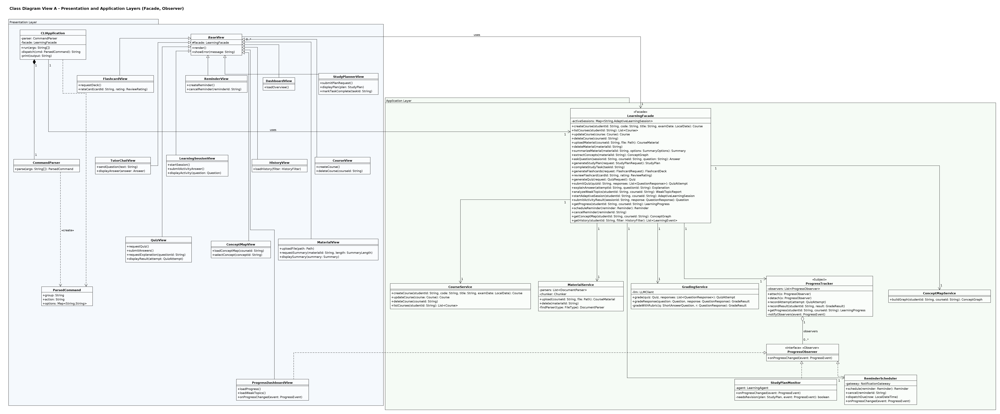

*Figure 3. View A - Presentation and Application layers (`02a-class-presentation-application.uxf`).*

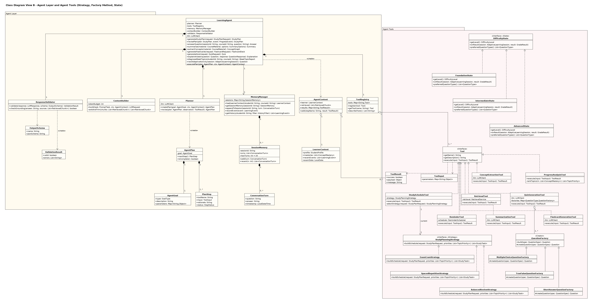

*Figure 4. View B - Agent layer and agent tools, including Strategy, Factory Method and State participants (`02b-class-agent-tools.uxf`).*

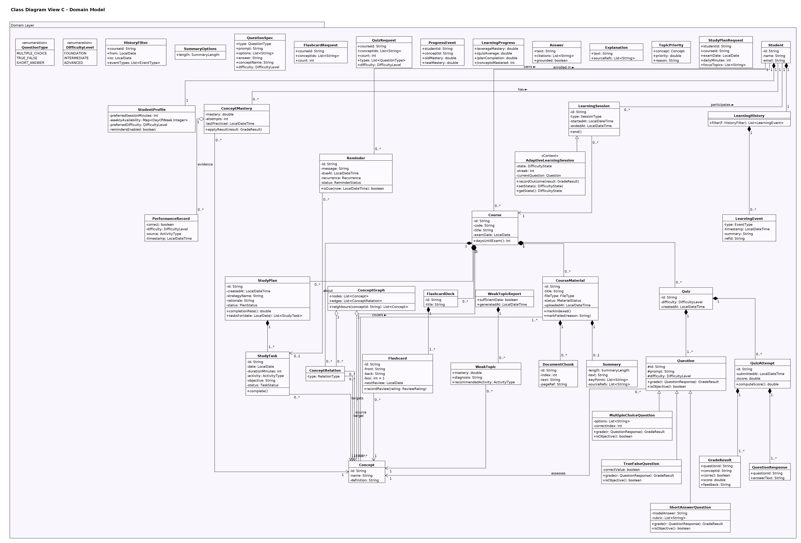

*Figure 5. View C - Domain model (`02c-class-domain.uxf`).*



*Figure 6. View D - AI/Integration and Persistence layers, including the Adapter participants (`02d-class-integration-persistence.uxf`).*

**Notation.** UML conventions from the course are followed: `<<interface>>` and italic names for interfaces, italic names for abstract classes and abstract operations (`Question`, `QuestionFactory.createQuestion()`), visibility `+ - # ~`, derived attributes prefixed with `/` (`QuizAttempt./score`, `LearningProgress./averageMastery`), operations as `name(param : Type) : ReturnType`, return type omitted for `void`, trivial getters/setters omitted, and all interface operations shown (and repeated on realizing classes). Stereotypes mark pattern roles (`<<Facade>>`, `<<Subject>>`, `<<Observer>>`, `<<Strategy>>`, `<<Creator>>`, `<<State>>`, `<<Context>>`, `<<Adapter>>`, `<<Adaptee>>`, `<<Target>>`).

### 4.2 Class Responsibilities

**Presentation**

| Class | Responsibility |
|---|---|
| `BaseView` (abstract) | Common view behaviour; holds the `LearningFacade` reference. |
| `DashboardView`, `CourseView`, `MaterialView`, `StudyPlannerView`, `TutorChatView`, `QuizView`, `FlashcardView`, `LearningSessionView`, `ProgressDashboardView`, `ConceptMapView`, `ReminderView`, `HistoryView` | One GUI screen each; translate user actions into facade calls (see method names in Figure 3). `ProgressDashboardView` is also a `ProgressObserver`. |
| `CLIApplication` | CLI entry point: `run(args)`, `dispatch(cmd)` to the facade, `print()` results. |
| `CommandParser` / `ParsedCommand` | Parse and represent `study <group> <action> --options`. |

**Application**

| Class | Responsibility |
|---|---|
| `LearningFacade` | Unified API for GUI and CLI; validation; delegation; persistence of agent results; active session registry. |
| `CourseService` | Course CRUD and validation rules (unique code, valid exam date). |
| `MaterialService` | File type detection, parsing, chunking, indexing, status management. |
| `GradingService` | Grades quizzes/activities: polymorphic objective grading, rubric-based LLM grading for short answers. |
| `ProgressTracker` | Applies results to mastery, stores performance, computes `LearningProgress`, notifies observers. |
| `ProgressObserver` | Observer interface (`onProgressChanged`). |
| `StudyPlanMonitor` | Observer that decides when the active plan needs revision and asks the agent to revise it. |
| `ReminderScheduler` | Stores and dispatches reminders; observer that creates review reminders for sharply weakening concepts. |
| `ConceptMapService` | Assembles a mastery-coloured `ConceptGraph`. |

**Agent and tools** - see §4.4.

**Domain**

| Class | Responsibility |
|---|---|
| `Student`, `StudentProfile` | Identity; preferences (session length, weekly availability, preferred difficulty, reminders on/off). |
| `Course` | Container for all course learning data; `daysUntilExam()`. |
| `CourseMaterial`, `DocumentChunk`, `Summary` | Uploaded file with processing status; its retrievable chunks; its summary. |
| `Concept`, `ConceptRelation`, `ConceptGraph` | Units of knowledge, typed relations, and the assembled graph used by the concept map. |
| `StudyPlanRequest`, `StudyPlan`, `StudyTask`, `TopicPriority` | Plan input, the plan and its scheduled tasks, and the ranked topics used to build it. |
| `Quiz`, `Question` (abstract), `MultipleChoiceQuestion`, `TrueFalseQuestion`, `ShortAnswerQuestion` | Quiz and polymorphic questions (`grade()`, `isObjective()`). |
| `QuizAttempt`, `QuestionResponse`, `GradeResult`, `Explanation` | Submitted answers, per-question results, derived score, AI explanation. |
| `FlashcardDeck`, `Flashcard` | Deck and cards with Leitner state (`box`, `nextReview`). |
| `ConceptMastery`, `PerformanceRecord`, `LearningProgress`, `ProgressEvent` | Mastery model, evidence, derived course progress, change notification payload. |
| `WeakTopicReport`, `WeakTopic` | Result of weak-topic analysis. |
| `LearningSession`, `AdaptiveLearningSession` | Study session; adaptive session that delegates difficulty behaviour to its `DifficultyState`. |
| `LearningHistory`, `LearningEvent` | Long-term activity log. |
| `Reminder` | Scheduled notification (`isDue()`). |
| `QuizRequest`, `FlashcardRequest`, `StudyPlanRequest`, `QuestionSpec`, `SummaryOptions`, `HistoryFilter` | Request/value objects passed from the presentation layer through the facade, and the validated intermediate form of LLM-generated questions. |
| `DifficultyLevel`, `QuestionType` (enums) | Shared enumerations. Other enumerations used only as attribute types (`FileType`, `MaterialStatus`, `SummaryLength`, `ActivityType`, `TaskStatus`, `PlanStatus`, `SessionType`, `EventType`, `RelationType`, `ReviewRating`, `Recurrence`, `ReminderStatus`, `GoalType`, `StepStatus`, `PromptTask`) are plain value enums omitted from the diagram for readability; their values are named in the text where relevant. Error types (`ValidationError`, `UnsupportedFileTypeError`, `MaterialProcessingError`, `MaterialNotProcessedError`, `NotFoundError`, `AgentError`) are exceptions and are likewise not drawn. |

**AI/Integration and Persistence** - `LLMClient`, `GeminiLLMAdapter`, `OpenAILLMAdapter` (§5.5); `EmbeddingService`, `VectorStore`, `RetrievalService`, `RetrievedChunk` (semantic retrieval with threshold); `DocumentParser` and its three implementations, `Chunker`; `NotificationGateway`, `DesktopNotificationGateway`; repository interfaces (§3.7).

### 4.3 Relationships and Multiplicities

| Relationship | Kind | Multiplicity | Justification |
|---|---|---|---|
| `Student` - `StudentProfile` | Composition | 1 - 1 | A profile has no meaning without its student and is deleted with it. |
| `Student` - `Course` | Association | 1 - 0..* | A student may have no courses yet; each course belongs to one student (single-user tool). |
| `Student` - `LearningHistory` - `LearningEvent` | Composition | 1 - 1, 1 - 0..* | The history log is owned by the student; events never exist outside a history. |
| `Student` - `ConceptMastery` / `LearningSession` / `Reminder` | Association | 1 - 0..* | Per-student records; navigated from the student. |
| `Course` - `CourseMaterial` | Composition | 1 - 0..* | Deleting a course deletes its materials; a new course has none. |
| `CourseMaterial` - `DocumentChunk` | Composition | 1 - 0..* | Chunks are derived from and die with the material (0 if extraction failed). |
| `CourseMaterial` - `Summary` | Composition | 1 - 0..1 | At most one current summary; regenerated summaries replace it. |
| `Course` - `Concept`, `Course` - `ConceptRelation` | Composition | 1 - 0..* | Concepts are course-scoped (the same name in two courses is two concepts). |
| `ConceptRelation` → `Concept` (source, target) | Directed association | 0..* - 1 each | Each relation connects exactly two concepts; a concept may take part in many relations. Modelled as a class (rather than a reflexive association) because the relation has a `type`. |
| `CourseMaterial` - `Concept` (covers) | Association | 1..* - 0..* | A concept is extracted from at least one material; materials can cover many concepts. |
| `Course` - `StudyPlan` - `StudyTask` | Composition | 1 - 0..*, 1 - 1..* | A plan without tasks is meaningless (1..*); tasks die with their plan. |
| `StudyTask` → `Concept` | Directed association | 0..* - 1..* | Each task targets at least one concept; concepts outlive tasks. |
| `Course` - `Quiz` - `Question` | Composition | 1 - 0..*, 1 - 1..* | A quiz always has at least one question; questions belong to one quiz. |
| `Question` <\|-- three subclasses | Generalization | - | True substitutability: every subclass can be graded through `grade()`. |
| `Question` → `Concept` (assesses) | Directed association | 0..* - 1 | Each question assesses one concept so results can update mastery. |
| `Quiz` - `QuizAttempt` - `QuestionResponse`/`GradeResult` | Composition | 1 - 0..*, 1 - 1..* | Attempts and their results are meaningless without the quiz. |
| `Course` - `FlashcardDeck` - `Flashcard` | Composition | 1 - 0..*, 1 - 1..* | Cards belong to one deck. |
| `ConceptMastery` → `Concept`; `ConceptMastery` o-- `PerformanceRecord` | Association; Aggregation | 0..* - 1; 1 - 0..* | Performance records are evidence that also exist independently (history, analytics), so the whole-part relation is weak. |
| `LearningSession` <\|-- `AdaptiveLearningSession` | Generalization | - | An adaptive session is a learning session with extra behaviour. |
| `AdaptiveLearningSession` → `DifficultyState` | Directed association | 1 - 1 | Always exactly one current state (State pattern). |
| `WeakTopicReport` - `WeakTopic` | Composition | 1 - 0..* | Zero weak topics is a valid result. |
| `ConceptGraph` o-- `Concept`, `ConceptRelation` | Aggregation | 1 - 0..* | The graph is a transient view; concepts exist independently of it. |
| `BaseView`, `CLIApplication` → `LearningFacade` | Association | 0..*/1 - 1 | All UI goes through one facade. |
| `CLIApplication` - `CommandParser` | Composition | 1 - 1 | The parser is created and owned by the CLI. |
| `LearningAgent` - `Planner`, `ToolRegistry`, `ContextBuilder`, `ResponseValidator` | Composition | 1 - 1 | Internal agent components created and owned by the agent. |
| `LearningAgent` → `MemoryManager`, `LLMClient` | Association | 1 - 1 | Shared with other components (facade, services), so not owned. |
| `ToolRegistry` o-- `Tool` | Aggregation | 1 - 1..* | Tools are constructed independently (with their own dependencies) and registered. |
| `AgentPlan` - `PlanStep`, `AgentGoal` | Composition | 1 - 1..*, 1 - 1 | Steps exist only within a plan. |
| `MemoryManager` - `SessionMemory` | Composition | 1 - 0..* | Session memories are created and discarded by the memory manager. |
| `ProgressTracker` o-- `ProgressObserver` | Aggregation | 1 - 0..* | Observers have independent lifecycles and are attached/detached at runtime. |
| `QuizGenerationTool` o-- `QuestionFactory` | Aggregation | 1 - 1..* | One factory per `QuestionType`, registered at start-up. |
| `StudyScheduleTool` → `StudyPlanningStrategy` | Directed association | 1 - 1 | The currently selected strategy. |
| `MaterialService` o-- `DocumentParser`; `MaterialService` *-- `Chunker` | Aggregation; Composition | 1 - 1..*; 1 - 1 | Parsers are pluggable and shared; the chunker is internal. |
| `Gemini/OpenAILLMAdapter` → SDK client | Directed association | 1 - 1 | Adapter holds its adaptee. |
| Realizations (`<\|..`) | Realization | - | `Tool` (8 tools), `StudyPlanningStrategy` (3), `DifficultyState` (3), `ProgressObserver` (3), `LLMClient` (2), `DocumentParser` (3), `NotificationGateway` (1). |
| Dependencies (`..>`) | Dependency | - | Use without ownership, e.g. services → repositories, `<<create>>` dependencies (`Planner ..> AgentPlan`, `QuestionFactory ..> Question`, `GradingService ..> QuizAttempt`). |

### 4.4 AI / Agent Classes

| Class | Why it exists |
|---|---|
| `LearningAgent` | Owns the agent loop and the goal-level decisions (which plan, when to retry, when to fall back, what to remember). Without it, AI logic would be scattered across services. |
| `Planner` | Separates *deciding what to do* from *doing it*. For known goals it instantiates a plan template; for open-ended goals it asks the LLM to choose from `ToolRegistry.describeTools()`. `revise()` reacts to failed or empty tool results. |
| `AgentGoal`, `AgentPlan`, `PlanStep`, `AgentContext` | Make the agent's reasoning explicit, inspectable and testable (a plan can be logged and unit-tested without an LLM). |
| `ToolRegistry`, `Tool`, `ToolInput`, `ToolResult` | Uniform interface for every capability the agent can invoke; new tools are added by registration without changing the agent. |
| `RetrievalTool` | Grounding: fetches relevant chunks before any material-based generation. |
| `SummarizationTool`, `ConceptExtractionTool`, `QuizGenerationTool`, `FlashcardGenerationTool` | LLM-backed generation capabilities, each with its own output schema. |
| `ProgressAnalysisTool` | Deterministic tool that ranks topics from mastery - lets the agent reason with facts instead of asking the LLM to guess weaknesses. |
| `StudyScheduleTool` | Deterministic tool that turns priorities into a time-feasible schedule via a `StudyPlanningStrategy`. |
| `ReminderTool` | Lets the agent act in the world (schedule reminders for plan tasks). |
| `MemoryManager`, `SessionMemory`, `ConversationTurn`, `LearnerContext` | Short-term conversational memory and long-term learner state used as context. |
| `ContextBuilder` | Builds prompts within a token budget (ranks and trims chunks, inserts instructions and output schemas). |
| `ResponseValidator`, `OutputSchema`, `ValidationResult` | Deterministic guardrail: validates structured outputs against schemas and checks that answers cite retrieved sources. |
| `LLMClient` + adapters | Provider-independent model access. |
| `RetrievalService`, `EmbeddingService`, `VectorStore` | Semantic retrieval with a relevance threshold. |

---

## 5. Design Patterns

Six GoF patterns are used. Each solves a specific problem in this application; none was added only to reach the minimum of five.

### 5.1 Strategy - study scheduling

| | |
|---|---|
| **Problem** | How study time is distributed depends on the situation: a student with 4 days before an exam needs intensive, weak-first practice; a student with 6 weeks benefits from spaced repetition; a student with no exam date needs balanced review. Encoding all three in one method would produce a large conditional that grows with every new approach. |
| **Participants and roles** | *Strategy*: `StudyPlanningStrategy` (`buildSchedule()`). *Concrete strategies*: `ExamCramStrategy`, `SpacedRepetitionStrategy`, `BalancedReviewStrategy`. *Context*: `StudyScheduleTool`, which holds the current strategy and selects it in `selectStrategy(request)` (≤ 7 days → cram; long horizon → spaced repetition; otherwise balanced). |
| **Rationale** | The algorithms share one input/output contract (request + priorities → tasks) but differ completely internally; they are interchangeable at runtime based on the request. |
| **Consequences** | New strategies (e.g. "interleaved practice") are added as one class with no change to the agent or the tool's callers; each strategy is unit-testable with fixed priorities. Without Strategy, `StudyScheduleTool` would contain all algorithms in one method, violating the open-closed principle and making each algorithm hard to test in isolation. |

### 5.2 Factory Method - question creation

| | |
|---|---|
| **Problem** | The LLM returns question specifications as JSON with a `type` field. The system must turn each into the correct `Question` subclass, validating type-specific constraints (MCQ needs 3-5 options and a valid `correctIndex`; true/false needs a boolean; short answer needs a model answer and rubric). Creating objects with `switch(type)` in the tool would couple it to every concrete question class. |
| **Participants and roles** | *Creator*: abstract `QuestionFactory` with the template operation `build(spec)` (common validation) and the factory method `createQuestion(spec)`. *Concrete creators*: `MultipleChoiceQuestionFactory`, `TrueFalseQuestionFactory`, `ShortAnswerQuestionFactory`. *Product*: abstract `Question`. *Concrete products*: `MultipleChoiceQuestion`, `TrueFalseQuestion`, `ShortAnswerQuestion`. *Client*: `QuizGenerationTool`, which holds one factory per `QuestionType`. |
| **Rationale** | Subclasses decide which product to instantiate and enforce product-specific validation; the client only knows `QuestionFactory` and `Question`. |
| **Consequences** | Adding a new question type (e.g. code-tracing questions) means one new product and one new factory registered in the map - `QuizGenerationTool`, `GradingService` (which grades through the polymorphic `grade()`) and the views do not change. Without it, every tool that creates questions (quiz generation and adaptive sessions) would repeat the conditional creation and validation logic. |

### 5.3 Facade - unified application API for GUI and CLI

| | |
|---|---|
| **Problem** | Each feature involves several subsystems (agent, services, repositories, retrieval). The GUI and the CLI must both access all features; if each called subsystems directly, the orchestration logic would be duplicated in two front-ends and the UI would be coupled to internal classes. |
| **Participants and roles** | *Facade*: `LearningFacade`. *Subsystem classes*: `LearningAgent`, `CourseService`, `MaterialService`, `GradingService`, `ProgressTracker`, `ReminderScheduler`, `ConceptMapService`, `MemoryManager`, repositories. *Clients*: all `BaseView` subclasses and `CLIApplication`. |
| **Rationale** | Directly satisfies the requirement that GUI and CLI expose the same functionality; it is the single place for input validation and persistence of agent results. |
| **Consequences** | Front-ends depend on one class; internal refactoring (e.g. splitting a service) does not affect them; a future web or test front-end can reuse it unchanged. Without it, `QuizView` and the CLI quiz command would each need to know about `GradingService`, `QuizRepository` and `ProgressTracker` and the call order between them. The trade-off - a large interface - is controlled by keeping the facade thin (delegation only). |

### 5.4 Observer - progress changes

| | |
|---|---|
| **Problem** | When mastery changes (after quizzes, adaptive activities or flashcard reviews), several independent parts must react: the progress dashboard refreshes, the study plan may need revision, and a review reminder may be needed. Hard-coding these calls into `ProgressTracker` would couple the tracker to the GUI, the agent and the reminder subsystem. |
| **Participants and roles** | *Subject*: `ProgressTracker` (`attach()`, `detach()`, `notifyObservers()`). *Observer*: `ProgressObserver` (`onProgressChanged(event)`). *Concrete observers*: `ProgressDashboardView`, `StudyPlanMonitor`, `ReminderScheduler`. *Event*: `ProgressEvent`. |
| **Rationale** | One-to-many dependency where the subject should not know concrete receivers; observers are attached at start-up (and the dashboard only while it is open). |
| **Consequences** | Adaptation (plan revision, reminders) happens automatically without the grading code knowing about it; new reactions (e.g. an achievements panel) are added as observers. Without Observer, `ProgressTracker.recordResult()` would call the view, the agent and the scheduler directly, creating an upward dependency from the application layer to the presentation layer. |

### 5.5 Adapter - LLM provider independence

| | |
|---|---|
| **Problem** | Gemini and OpenAI SDKs expose incompatible APIs (different method names, request structures, structured-output mechanisms and error types). The agent, tools and grading service must not depend on any vendor SDK. |
| **Participants and roles** | *Target*: `LLMClient` (`generate()`, `generateStructured()`, `getModelName()`). *Adapters*: `GeminiLLMAdapter`, `OpenAILLMAdapter`. *Adaptees*: `GeminiSdkClient` (`generateContent()`), `OpenAISdkClient` (`createChatCompletion()`). *Clients*: `LearningAgent`, `Planner`, generation tools, `GradingService`. |
| **Rationale** | The interface the system needs already exists (`LLMClient`); the vendor classes cannot be changed, so they are wrapped. Adapters also translate vendor-specific errors into one common error type and normalise token usage. |
| **Consequences** | Switching provider is a configuration change; tests can use a deterministic fake `LLMClient`. Without Adapter, vendor-specific code would appear in at least seven classes and a provider change (pricing, availability, course restrictions) would require editing all of them. |

### 5.6 State - adaptive difficulty

| | |
|---|---|
| **Problem** | An adaptive session behaves differently at each difficulty level: which question types are used, how hard they are, and when to move up or down. Implementing this with `if (level == ...)` checks inside `AdaptiveLearningSession` and `LearningAgent` would scatter the transition rules. |
| **Participants and roles** | *Context*: `AdaptiveLearningSession` (`recordOutcome()`, `setState()`, `getState()`). *State*: `DifficultyState` (`getLevel()`, `onResult()`, `preferredQuestionTypes()`). *Concrete states*: `FoundationState` (true/false and MCQ; up after 3 consecutive correct), `IntermediateState` (MCQ and short answer; up after 3 correct, down after 2 incorrect), `AdvancedState` (short answer and harder MCQ; down after 2 incorrect). |
| **Rationale** | Behaviour depends on a state that changes at runtime, and the transition rules belong naturally to each state. |
| **Consequences** | Transition rules are explicit, deterministic and unit-testable; adding a level (e.g. "Exam-ready") means adding one state class. Without State, difficulty logic would be duplicated between the session and the agent and would be hard to verify. This is also where the AI/deterministic split is clearest: the **state machine decides the difficulty**, the **LLM only generates content** at that difficulty. |

**Not counted as patterns.** The repository interfaces follow the Repository/DAO idea but are not GoF patterns; MVC describes the presentation architecture (§3.2); the `Tool` interface is a uniform capability interface used by the agent and is not presented as a separate pattern.

---
## 6. Use-Case Model

### 6.1 Actors

| Actor | Type | Description |
|---|---|---|
| **Student** | Primary, human | Initiates every use case through the GUI or CLI. |
| **LLM Provider** | Secondary, external system | The external AI service (Gemini or OpenAI API) that performs language generation and embedding. It is outside the system boundary - the system only owns the `LLMClient` adapters that talk to it. Connected to every use case whose main scenario requires generation. |
| **Notification Service** | Secondary, external system | Operating-system notification centre that displays reminders. Connected to UC14. |

**Actors deliberately excluded.** An *Administrator* is not included because the system is a personal, single-user study tool with no shared data to administer; inventing one would add use cases without requirements. *Document storage* and the *database* are internal to the system (persistence layer), so they are not actors. Time-triggered reminder dispatch is modelled inside UC14 rather than with a separate "Clock" actor.

### 6.2 Use-Case Diagram


*Figure 7. Use-case diagram (`01-use-case.uxf`).*

**Relationships and justification**

- `UC02 Upload Learning Material` **«include»** `UC04 Extract Concepts`: upload is not complete until the material's concepts are known, because every personalised feature works at concept level. UC04 can also be run on its own (re-extraction).
- `UC05`, `UC06`, `UC07`, `UC08` **«include»** `UC17 Retrieve Relevant Material`: four use cases share the same mandatory retrieval behaviour; including it avoids repeating it in four descriptions. UC17 is not a student goal by itself, so it has no actor association.
- `UC06 Generate Study Plan` and `UC12 Start Adaptive Learning Session` **«include»** `UC11 Analyze Weak Topics`: both cannot proceed without knowing the weak topics.
- `UC10 Review Answer Explanation` **«extend»** `UC09 Take and Grade Quiz` at the extension point *review results*: explanations are optional; UC09 is complete without them.
- No use-case generalization is used because no use case is a specialised variant of another.

### 6.3 Detailed Use Cases

#### UC01 - Manage Courses
- **Primary actor:** Student. **Supporting actors:** none. **Related features:** F01.
- **Goal:** Create, view, update or delete a course.
- **Preconditions:** Application running; student profile exists.
- **Trigger:** Student selects "New Course" (or edit/delete) in *Courses*, or runs `study course ...`.
- **Main success scenario (create):** 1. Student enters code, title and optional exam date. 2. System validates that the code is unique for the student and the exam date is not in the past. 3. System creates and stores the course. 4. System records a `COURSE_CREATED` event. 5. System shows the course in the list.
- **Alternative flows:** A1 *Update*: student edits fields; steps 2-5 with an update. A2 *Delete*: system asks for confirmation, then deletes the course and everything it owns (materials, chunks and their vectors, concepts, plans, quizzes, decks).
- **Exception flows:** E1 Duplicate code → error, nothing stored. E2 Exam date in the past → error.
- **Postconditions:** Course list reflects the change.

#### UC02 - Upload Learning Material
- **Primary actor:** Student. **Supporting actors:** LLM Provider (embeddings; concept extraction via UC04). **Related features:** F02 (and F04 via include).
- **Goal:** Make a course file available for AI-supported learning.
- **Preconditions:** Course exists.
- **Trigger:** Student clicks "Upload" or runs `study material upload`.
- **Main success scenario:** 1. Student selects a file. 2. System finds a parser that supports the file type. 3. System extracts the text. 4. System splits it into chunks, embeds and indexes them. 5. System marks the material `INDEXED` and stores it. 6. **Include UC04** (extract concepts). 7. System shows the material and its concepts.
- **Alternative flows:** A1 Student deletes a material: system removes it, its chunks, vectors and summary.
- **Exception flows:** E1 Unsupported type → error listing supported types; nothing stored. E2 No readable text → material stored as `FAILED` with reason; student told to upload a text-based version. E3 Embedding service unavailable → material stays `UPLOADED`; indexing retried.
- **Postconditions:** Material is searchable by retrieval; concepts updated.

#### UC03 - Summarize Material
- **Primary actor:** Student. **Supporting actors:** LLM Provider. **Related features:** F03.
- **Goal:** Obtain a summary of one material.
- **Preconditions:** Material is `INDEXED`.
- **Trigger:** "Summarize" in *Course Materials* or `study material summarize`.
- **Main success scenario:** 1. Student selects material and length. 2. System loads the material's chunks. 3. Agent plans single-pass or map-reduce summarisation. 4. Agent summarises sections and combines them. 5. System validates the output, stores and displays the summary with page references.
- **Alternative flows:** A1 A summary already exists → shown immediately with "Regenerate" option.
- **Exception flows:** E1 Material not found. E2 Material not processed (unsupported/failed) → explanatory error. E3 LLM failure → "try again later"; nothing stored.
- **Postconditions:** Summary stored; event recorded.

#### UC04 - Extract Concepts
- **Primary actor:** Student (directly, or via UC02). **Supporting actors:** LLM Provider. **Related features:** F04, F15.
- **Goal:** Identify the concepts and concept relations in a material.
- **Preconditions:** Material is `INDEXED`.
- **Trigger:** Included by UC02, or "Re-extract concepts" / `study material extract-concepts`.
- **Main success scenario:** 1. Agent sends chunk batches to the concept extraction tool. 2. LLM returns concepts and relations. 3. System validates them (drops relations to unknown concepts). 4. System merges concepts into the course set by normalised name and stores relations. 5. Concepts are shown under the material.
- **Exception flows:** E1 LLM unavailable/invalid output → warning; material remains usable; student may retry.
- **Postconditions:** Course concept graph updated without duplicates.

#### UC05 - Ask Questions about Material
- **Primary actor:** Student. **Supporting actors:** LLM Provider. **Related features:** F05.
- **Goal:** Get a correct, source-cited answer to a course question.
- **Preconditions:** Course selected.
- **Trigger:** Student sends a question in *AI Tutor* or runs `study ask`.
- **Main success scenario:** 1. Student submits a question. 2. Agent reads recent conversation turns. 3. Agent plans retrieval + answer. 4. **Include UC17**. 5. Agent builds a prompt restricted to the retrieved sources and generates the answer. 6. System checks grounding. 7. System displays the answer with citations and stores the turn and event.
- **Alternative flows:** A1 Follow-up question → session memory resolves references (e.g. "what about interfaces?").
- **Exception flows:** E1 No relevant material → system says so without calling the LLM, offers to upload material or give a labelled general explanation. E2 Answer not grounded → one stricter regeneration, then answer flagged. E3 LLM unavailable → error; question kept.
- **Postconditions:** Session memory and history updated.

#### UC06 - Generate Study Plan
- **Primary actor:** Student. **Supporting actors:** LLM Provider. **Related features:** F06, F11.
- **Goal:** Obtain a personalised day-by-day plan until the exam.
- **Preconditions:** Course exists.
- **Trigger:** "Generate Plan" or `study study-plan generate`.
- **Main success scenario:** 1. Student enters exam date, daily minutes and optional focus topics. 2. System validates input. 3. Agent loads learner context. 4. **Include UC11** (weak topics). 5. **Include UC17** (retrieve material for weak and focus topics). 6. Agent reasons about priorities and objectives (LLM) and validates the result. 7. Agent selects a scheduling strategy and builds tasks. 8. If reminders are enabled, agent schedules task reminders. 9. System stores the plan (archiving the previous one) and displays it with its rationale.
- **Alternative flows:** A1 Student marks a task complete → completion rate updated. A2 Mastery changes significantly later → system revises the plan automatically (SD04) and notifies the student.
- **Exception flows:** E1 Invalid input → validation error. E2 No relevant material → plan generated from concept names, with a warning. E3 LLM output invalid after retry → deterministic priorities used. E4 Too little time → lowest-priority topics reported as not scheduled.
- **Postconditions:** One active plan per course; event recorded.

#### UC07 - Generate and Review Flashcards
- **Primary actor:** Student. **Supporting actors:** LLM Provider. **Related features:** F07, F13.
- **Goal:** Create and review flashcards for selected topics.
- **Preconditions:** Course with indexed material.
- **Trigger:** "Generate" in *Flashcards* or `study flashcards generate`.
- **Main success scenario:** 1. Student chooses topics and number of cards. 2. **Include UC17**. 3. Agent generates card pairs. 4. System removes empty/duplicate cards and stores the deck. 5. Student reviews cards and rates each. 6. System updates each card's Leitner box and next review date and records the result as mastery evidence.
- **Exception flows:** E1 No material for topic → error. E2 Fewer valid cards than requested → deck created with the valid cards and shortfall reported. E3 CLI syntax error → usage help.
- **Postconditions:** Deck stored; review schedule and mastery updated.

#### UC08 - Generate Quiz
- **Primary actor:** Student. **Supporting actors:** LLM Provider. **Related features:** F08.
- **Goal:** Get a quiz on chosen concepts at a chosen difficulty.
- **Preconditions:** Course has concepts and indexed material.
- **Trigger:** "Generate Quiz" or `study quiz generate`.
- **Main success scenario:** 1. Student chooses concepts, count, types and difficulty. 2. **Include UC17**. 3. Agent generates question specifications. 4. Each specification is validated and turned into a typed question by its factory. 5. System stores and displays the quiz.
- **Exception flows:** E1 Invalid specifications → replacement round (max 2). E2 Still short → smaller quiz with notice. E3 LLM unavailable → error.
- **Postconditions:** Quiz stored.

#### UC09 - Take and Grade Quiz
- **Primary actor:** Student. **Supporting actors:** LLM Provider (short answers only). **Related features:** F09, F13.
- **Goal:** Submit answers and receive a score.
- **Preconditions:** Quiz exists.
- **Trigger:** "Submit" in *Quiz Center* or finishing `study quiz take`.
- **Extension point:** *review results* (after step 5).
- **Main success scenario:** 1. Student answers and submits. 2. System grades objective questions exactly. 3. System grades short answers against the rubric using the LLM. 4. System computes the score and stores the attempt. 5. System updates performance records and concept mastery and notifies observers. 6. System displays results.
- **Exception flows:** E1 Unanswered questions → 0 for those. E2 LLM unavailable → short answers flagged "needs review" and excluded from mastery.
- **Postconditions:** Attempt stored; mastery updated; dashboard, plan monitor and reminder scheduler notified.

#### UC10 - Review Answer Explanation
- **Primary actor:** Student. **Supporting actors:** LLM Provider. **Related features:** F10.
- **Goal:** Understand why an answer is right or wrong.
- **Preconditions:** A graded attempt exists. **Extends** UC09 at *review results*.
- **Trigger:** "Explain" next to a question.
- **Main success scenario:** 1. Student selects a question. 2. System loads the question and the student's response. 3. Agent retrieves related material. 4. Agent generates an explanation referencing the material. 5. System displays it.
- **Exception flows:** E1 No relevant source → explanation from the model answer, labelled not source-backed. E2 LLM unavailable → correct answer shown without explanation.
- **Postconditions:** None persistent.

#### UC11 - Analyze Weak Topics
- **Primary actor:** Student (directly or via UC06/UC12). **Supporting actors:** LLM Provider. **Related features:** F11.
- **Goal:** Know which concepts are weakest and why.
- **Preconditions:** Course exists.
- **Trigger:** "Weak Topics" panel, `study weak-topics show`, or inclusion.
- **Main success scenario:** 1. System ranks concepts by mastery, recency and prerequisite weight. 2. For the weakest concepts, agent retrieves material and the student's wrong answers. 3. Agent diagnoses likely misconceptions and recommends activities. 4. System displays the report.
- **Exception flows:** E1 Insufficient data (< 5 graded attempts) → recommend diagnostic quiz. E2 LLM failure → ranking without diagnosis.
- **Postconditions:** Event recorded.

#### UC12 - Start Adaptive Learning Session
- **Primary actor:** Student. **Supporting actors:** LLM Provider. **Related features:** F12, F13, F06 (revision).
- **Goal:** Practise with activities whose difficulty and topic adapt to performance.
- **Preconditions:** Course has concepts and indexed material.
- **Trigger:** "Start session" or `study learning-session start`.
- **Main success scenario:** 1. System creates a session with an initial difficulty state derived from mastery. 2. **Include UC11** to select the target concept. 3. Agent generates an activity at the current level. 4. Student answers. 5. System grades, updates mastery and notifies observers (the plan may be revised). 6. The difficulty state transitions if its rule is met. 7. Steps 3-6 repeat until the student ends the session. 8. System records the session.
- **Exception flows:** E1 LLM unavailable → reuse stored questions at that level; otherwise end gracefully. E2 All concepts mastered → suggest mixed review.
- **Postconditions:** Mastery and history updated.

#### UC13 - View Learning Progress
- **Primary actor:** Student. **Related features:** F13.
- **Goal:** See current readiness.
- **Preconditions:** Course exists.
- **Trigger:** Open *Progress Dashboard* or `study progress show`.
- **Main success scenario:** 1. System loads mastery and performance records. 2. System computes derived progress values. 3. System displays charts; the view stays subscribed and refreshes when progress changes.
- **Exception flows:** E1 No data → empty state with suggestion.
- **Postconditions:** None.

#### UC14 - Manage Study Reminders
- **Primary actor:** Student. **Supporting actors:** Notification Service. **Related features:** F14.
- **Goal:** Be reminded to study at the right time.
- **Preconditions:** None.
- **Trigger:** Create/cancel in *Reminders* or `study reminder ...`; time reaching a reminder's due time.
- **Main success scenario:** 1. Student creates a reminder (message, time, recurrence). 2. System validates and stores it. 3. When due, system sends it to the Notification Service. 4. System marks it sent or computes the next occurrence.
- **Alternative flows:** A1 Student cancels a reminder. A2 System creates a reminder automatically (plan tasks via the agent; sharp mastery drop via the observer).
- **Exception flows:** E1 Past due time → rejected. E2 Delivery failure → retried next minute. E3 App closed at due time → delivered on next start.
- **Postconditions:** Reminder stored/updated.

#### UC15 - Explore Concept Map
- **Primary actor:** Student. **Related features:** F15.
- **Goal:** Understand how concepts relate and where weaknesses are.
- **Preconditions:** Concepts extracted.
- **Trigger:** Open *Concept Map* or `study concept-map show`.
- **Main success scenario:** 1. System loads concepts, relations and mastery. 2. System builds and displays a mastery-coloured graph. 3. Student selects a concept; system shows prerequisites and related concepts. 4. Optionally the student starts a quiz on it (UC08).
- **Exception flows:** E1 No concepts → empty state with guidance.
- **Postconditions:** None.

#### UC16 - View Learning History
- **Primary actor:** Student. **Related features:** F16.
- **Goal:** Review past learning activity.
- **Preconditions:** None.
- **Trigger:** Open *Learning History* or `study history show`.
- **Main success scenario:** 1. Student sets filters (course, period, type). 2. System retrieves matching events. 3. System displays them chronologically with links to related objects.
- **Exception flows:** E1 No events → "no activity" message.
- **Postconditions:** None.

#### UC17 - Retrieve Relevant Material (included use case)
- **Primary actor:** none (included by UC05, UC06, UC07, UC08). **Related features:** F05, F06, F07, F08.
- **Goal:** Provide the most relevant chunks of the student's material for a query.
- **Preconditions:** Course selected.
- **Main success scenario:** 1. Query is embedded. 2. Vector store returns the top-k chunks for the course. 3. Chunks below the relevance threshold are discarded. 4. Remaining chunks are returned with scores and source references.
- **Exception flows:** E1 No chunk above threshold → empty result; the including use case applies its own alternative flow.
- **Postconditions:** None.

---

## 7. Sequence Diagrams

All sequence diagrams use the class names and operations defined in §4 (verified in §12). Conventions: synchronous calls are solid arrows, returns are dashed arrows, activation bars show the executing object, `<<create>>` marks object creation, and `alt`, `opt`, `loop` and `group` fragments show conditions, options, iteration and grouping. Interface lifelines are labelled `<<interface>>`; pattern roles are shown as stereotypes.

| SD | Title | Features | Use cases | UMLet file |
|---|---|---|---|---|
| SD01 | Personalized Study Plan Generation | F06, F11 | UC06, UC11, UC17 | `03-sequence-study-plan.uxf` |
| SD02 | Question Answering over Course Materials | F05, F16 | UC05, UC17 | `04-sequence-material-qa.uxf` |
| SD03 | Quiz Generation, Grading and Answer Explanation | F08, F09, F10, F13 | UC08, UC09, UC10 | `05-sequence-quiz.uxf` |
| SD04 | Adaptive Learning Session | F12, F13, F06 | UC12, UC11 | `06-sequence-adaptive-learning.uxf` |
| SD05 | Material Summarization | F03 | UC03 | `07-sequence-summarization.uxf` |
| SD06 | Learning Progress and Weak-Topic Analysis | F13, F11 | UC13, UC11 | `08-sequence-progress-analysis.uxf` |
| SD07 | Material Upload, Indexing and Concept Extraction | F02, F04 | UC02, UC04 | `09-sequence-material-upload.uxf` |
| SD08 | Flashcard Generation (CLI) and Review (GUI) | F07, F13 | UC07, UC17 | `10-sequence-flashcards-cli.uxf` |
| SD09 | Study Reminder Management and Dispatch | F14 | UC14 | `11-sequence-reminders.uxf` |
| SD10 | Concept Relationship Visualization | F15 | UC15 | `12-sequence-concept-map.uxf` |
| SD11 | Course Management and Learning History (CLI) | F01, F16 | UC01, UC16 | `13-sequence-course-history-cli.uxf` |

### 7.1 SD01 - Personalized Study Plan

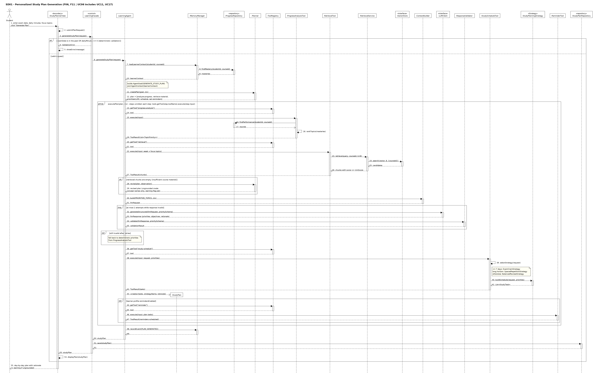

The facade validates the request deterministically. The agent observes (learner context from `ProgressRepository`), plans (five-step `AgentPlan`), and executes the steps through tools obtained from the `ToolRegistry`: deterministic weak-topic ranking, retrieval, LLM prioritisation (with schema validation and a bounded retry loop), deterministic scheduling through the selected `StudyPlanningStrategy`, and optional reminders. **Alternative flow:** if retrieval returns no chunks, `Planner.revise()` switches the plan to ungrounded mode and the plan is shown with a warning. If the LLM output stays invalid, deterministic priorities are used. Persistence is done by the facade.

### 7.2 SD02 - Material Q&A

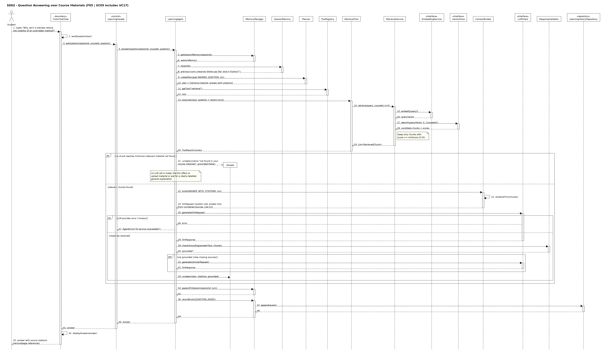

Grounding is enforced twice: by retrieval with a relevance threshold *before* generation, and by `ResponseValidator.checkGrounding()` *after* generation. **Alternative flow:** when no chunk passes the threshold the agent returns a "not found in your materials" `Answer` without calling the LLM. LLM errors produce an `AgentError`. Session memory supports follow-up questions; the event is appended to the learning history.

### 7.3 SD03 - Quiz Generation, Grading and Explanation

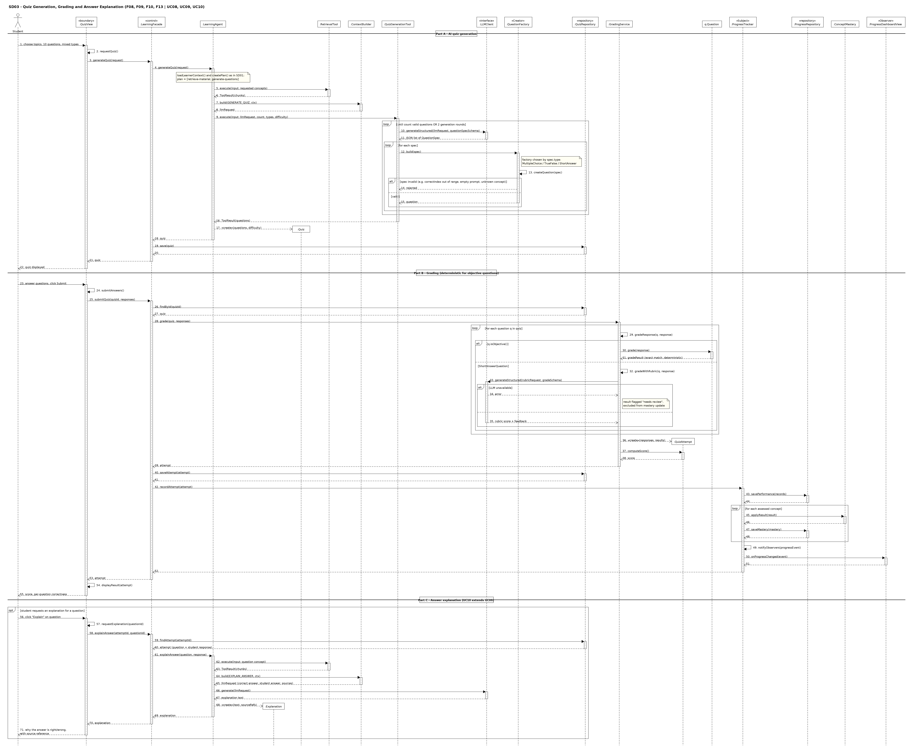

Part A shows **AI generation** followed by **Factory Method** creation and validation of each question. Part B shows **deterministic grading** through the polymorphic `Question.grade()` for objective questions and rubric-based LLM grading only for short answers, followed by mastery updates and **Observer** notification. Part C (optional fragment) realises UC10, which extends UC09.

### 7.4 SD04 - Adaptive Learning

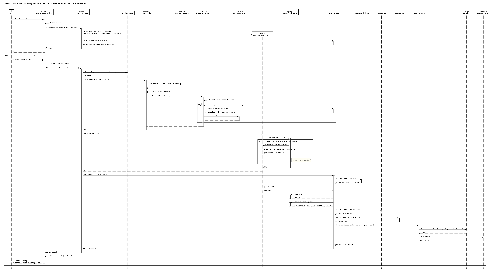

Each answer is graded, mastery is updated and observers are notified; `StudyPlanMonitor` may ask the agent to revise the active study plan. The session then delegates to its current `DifficultyState`, which may replace itself (**State** pattern). The agent selects the weakest concept (deterministic), reads the level and preferred question types from the state, and generates the next activity through `QuizGenerationTool` and `QuestionFactory`.

### 7.5 SD05 - Material Summarization

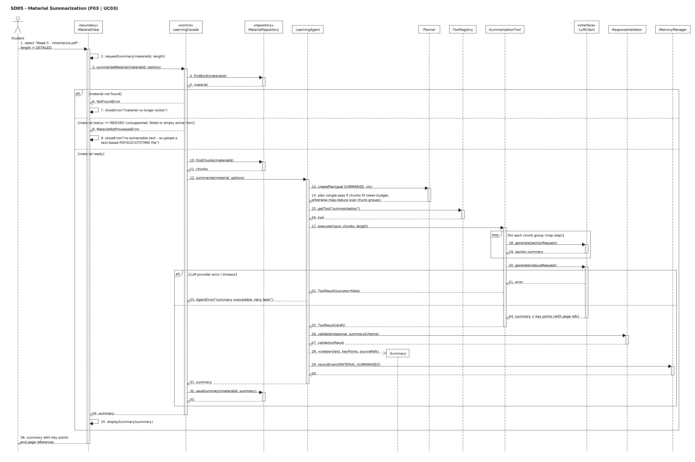

Invalid and unsupported documents are handled before any AI call (material not found; status not `INDEXED`, which covers unsupported formats and files with no extractable text). The planner chooses single-pass or map-reduce summarisation. LLM failure leaves no partial summary.

### 7.6 SD06 - Learning Progress and Weak-Topic Analysis

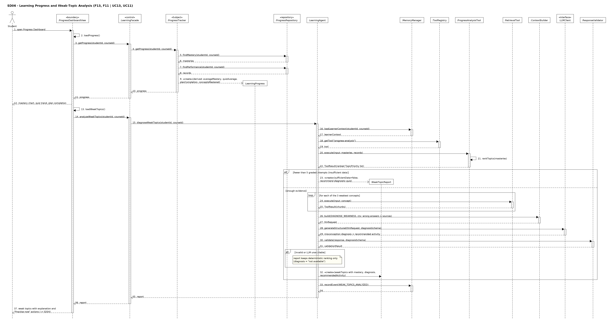

Progress values are derived deterministically (`LearningProgress` has only derived attributes). Weak-topic analysis combines the deterministic ranking with LLM diagnosis, with an insufficient-data alternative and an LLM-failure fallback.

### 7.7 SD07 - Material Upload and Concept Extraction

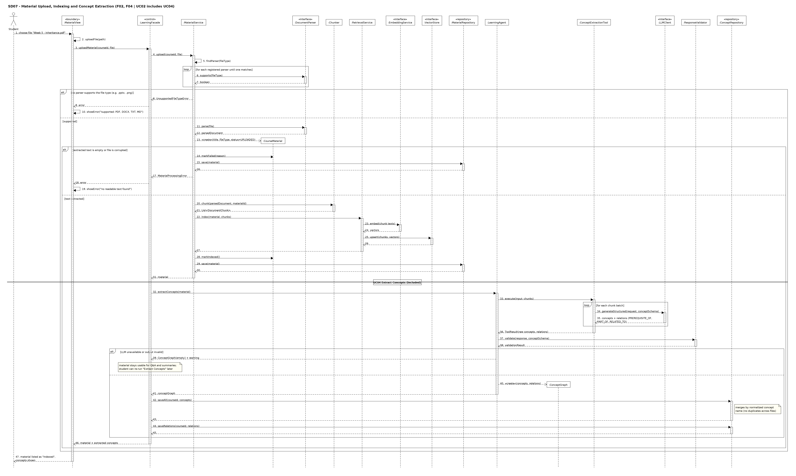

Shows parser selection by `supports()`, the unsupported-type and empty-text error paths, chunking and indexing, and the included concept extraction with de-duplication on save.

### 7.8 SD08 - Flashcards via CLI and Review via GUI

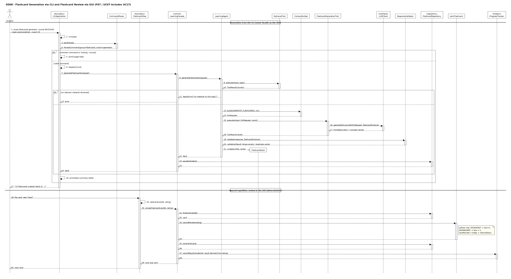

Demonstrates that the CLI reaches the same `LearningFacade` operation as the GUI. The review part shows the deterministic Leitner rule in `Flashcard.recordReview()` and feeds the result to `ProgressTracker`.

### 7.9 SD09 - Reminders

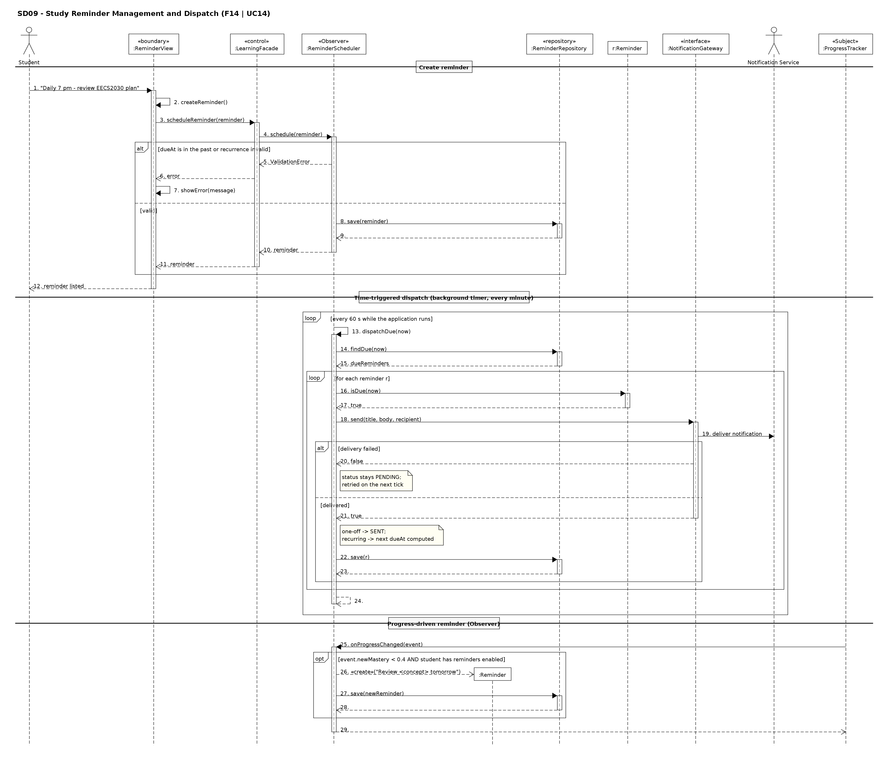

Covers creation with validation, time-triggered dispatch through `NotificationGateway` to the external Notification Service with failure handling, and reminder creation triggered by the Observer notification.

### 7.10 SD10 - Concept Map

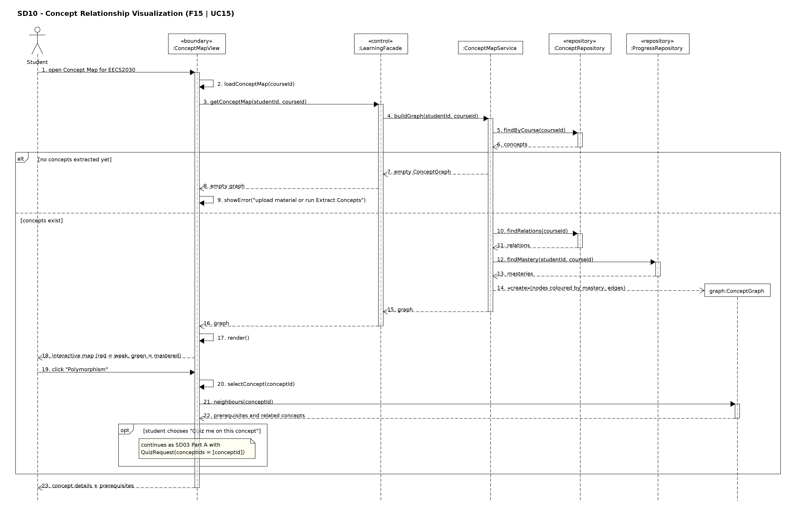

### 7.11 SD11 - Course Management and History via CLI

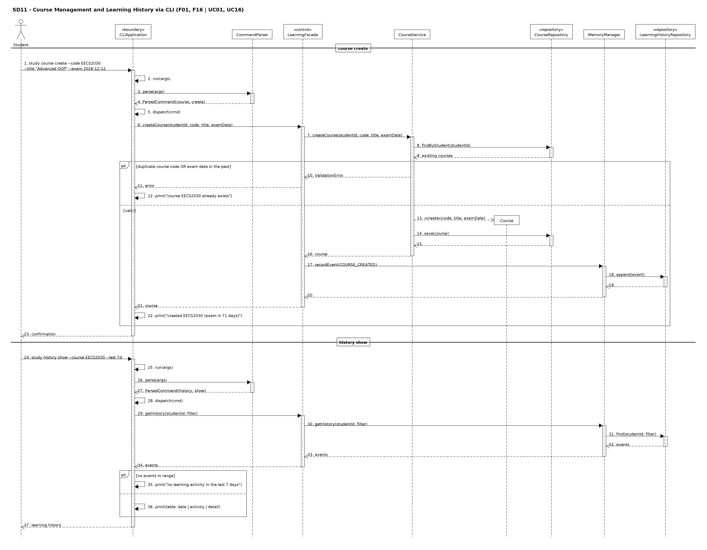

---
## 8. Feature-to-Design Traceability

| Feature | Description | Type | Use Case | Classes | Key Methods | Sequence Diagram | Design Pattern(s) |
|---|---|---|---|---|---|---|---|
| F01 | Course management | Deterministic | UC01 | `CourseView`, `CLIApplication`, `LearningFacade`, `CourseService`, `Course`, `CourseRepository`, `MemoryManager` | `createCourse()`, `updateCourse()`, `deleteCourse()`, `listCourses()`, `save()`, `findByStudent()` | SD11 | Facade |
| F02 | Material upload and management | Deterministic | UC02 | `MaterialView`, `LearningFacade`, `MaterialService`, `DocumentParser`, `Chunker`, `RetrievalService`, `EmbeddingService`, `VectorStore`, `CourseMaterial`, `MaterialRepository` | `uploadMaterial()`, `upload()`, `findParser()`, `supports()`, `parse()`, `chunk()`, `index()`, `embed()`, `upsert()`, `markIndexed()` | SD07 | Facade |
| F03 | Document summarization | AI-based | UC03 | `MaterialView`, `LearningFacade`, `MaterialRepository`, `LearningAgent`, `Planner`, `SummarizationTool`, `LLMClient`, `ResponseValidator`, `Summary` | `summarizeMaterial()`, `summarize()`, `createPlan()`, `execute()`, `generate()`, `validate()`, `saveSummary()` | SD05 | Facade, Adapter |
| F04 | Concept extraction | AI-based | UC04 | `LearningAgent`, `ConceptExtractionTool`, `LLMClient`, `ResponseValidator`, `ConceptGraph`, `Concept`, `ConceptRelation`, `ConceptRepository` | `extractConcepts()`, `execute()`, `generateStructured()`, `validate()`, `saveAll()`, `saveRelations()` | SD07 | Facade, Adapter |
| F05 | Q&A over course materials | Hybrid | UC05 | `TutorChatView`, `LearningFacade`, `LearningAgent`, `MemoryManager`, `SessionMemory`, `Planner`, `RetrievalTool`, `RetrievalService`, `VectorStore`, `ContextBuilder`, `LLMClient`, `ResponseValidator`, `Answer` | `askQuestion()`, `answerQuestion()`, `recent()`, `retrieve()`, `search()`, `build()`, `generate()`, `checkGrounding()`, `appendToSession()` | SD02 | Facade, Adapter |
| F06 | Personalized study plan | Hybrid | UC06 | `StudyPlannerView`, `LearningFacade`, `LearningAgent`, `Planner`, `ProgressAnalysisTool`, `RetrievalTool`, `ContextBuilder`, `LLMClient`, `StudyScheduleTool`, `StudyPlanningStrategy`, `ReminderTool`, `StudyPlan`, `StudyTask`, `StudyPlanRepository`, `StudyPlanMonitor` | `generateStudyPlan()`, `createPlan()`, `rankTopics()`, `generateStructured()`, `selectStrategy()`, `buildSchedule()`, `revisePlan()`, `save()` | SD01, SD04 | Strategy, Observer, Facade, Adapter |
| F07 | Flashcard generation and review | Hybrid | UC07 | `CLIApplication`, `CommandParser`, `FlashcardView`, `LearningFacade`, `LearningAgent`, `FlashcardGenerationTool`, `LLMClient`, `FlashcardDeck`, `Flashcard`, `FlashcardRepository`, `ProgressTracker` | `parse()`, `dispatch()`, `generateFlashcards()`, `execute()`, `saveDeck()`, `reviewFlashcard()`, `recordReview()`, `recordResult()` | SD08 | Facade, Adapter |
| F08 | Quiz generation | AI-based | UC08 | `QuizView`, `LearningFacade`, `LearningAgent`, `QuizGenerationTool`, `LLMClient`, `QuestionFactory` (+3), `Question` (+3), `Quiz`, `QuizRepository` | `generateQuiz()`, `execute()`, `generateStructured()`, `build()`, `createQuestion()`, `save()` | SD03 | Factory Method, Facade, Adapter |
| F09 | Automatic quiz grading | Hybrid | UC09 | `QuizView`, `LearningFacade`, `GradingService`, `Question` (+3), `QuizAttempt`, `GradeResult`, `ProgressTracker`, `ConceptMastery`, `ProgressRepository` | `submitQuiz()`, `grade()`, `gradeResponse()`, `isObjective()`, `gradeWithRubric()`, `computeScore()`, `recordAttempt()`, `applyResult()` | SD03 | Observer, Facade |
| F10 | Answer explanation | AI-based | UC10 | `QuizView`, `LearningFacade`, `QuizRepository`, `LearningAgent`, `RetrievalTool`, `ContextBuilder`, `LLMClient`, `Explanation` | `requestExplanation()`, `explainAnswer()`, `findAttempt()`, `build()`, `generate()` | SD03 | Facade, Adapter |
| F11 | Weak-topic identification | Hybrid | UC11 | `ProgressDashboardView`, `LearningFacade`, `LearningAgent`, `ProgressAnalysisTool`, `RetrievalTool`, `LLMClient`, `ResponseValidator`, `WeakTopicReport`, `WeakTopic` | `analyzeWeakTopics()`, `diagnoseWeakTopics()`, `execute()`, `rankTopics()`, `generateStructured()` | SD06, SD01 | Facade, Adapter |
| F12 | Adaptive question difficulty | Hybrid | UC12 | `LearningSessionView`, `LearningFacade`, `GradingService`, `AdaptiveLearningSession`, `DifficultyState` (+3), `LearningAgent`, `QuizGenerationTool`, `QuestionFactory` | `startAdaptiveSession()`, `submitActivityResult()`, `recordOutcome()`, `onResult()`, `setState()`, `getLevel()`, `preferredQuestionTypes()`, `nextAdaptiveActivity()` | SD04 | State, Observer, Factory Method, Facade |
| F13 | Learning progress tracking | Deterministic | UC13 | `ProgressDashboardView`, `LearningFacade`, `ProgressTracker`, `ProgressObserver`, `ProgressRepository`, `ConceptMastery`, `PerformanceRecord`, `LearningProgress` | `getProgress()`, `recordAttempt()`, `recordResult()`, `applyResult()`, `notifyObservers()`, `onProgressChanged()` | SD06, SD03, SD04 | Observer, Facade |
| F14 | Study reminders | Deterministic | UC14 | `ReminderView`, `LearningFacade`, `ReminderScheduler`, `ReminderRepository`, `Reminder`, `NotificationGateway` | `scheduleReminder()`, `schedule()`, `dispatchDue()`, `findDue()`, `isDue()`, `send()`, `onProgressChanged()` | SD09 | Observer, Facade |
| F15 | Concept relationship visualization | Hybrid | UC15 | `ConceptMapView`, `LearningFacade`, `ConceptMapService`, `ConceptRepository`, `ProgressRepository`, `ConceptGraph` | `loadConceptMap()`, `getConceptMap()`, `buildGraph()`, `findRelations()`, `neighbours()` | SD10 | Facade |
| F16 | Learning session history | Deterministic | UC16 | `HistoryView`, `CLIApplication`, `LearningFacade`, `MemoryManager`, `LearningEvent`, `LearningHistoryRepository` | `getHistory()`, `recordEvent()`, `append()`, `find()` | SD11, SD02 | Facade |

**Reverse traceability (every design element is used).** Every concrete class in the diagram participates in at least one feature above; every pattern is used by at least one feature (Strategy: F06; Factory Method: F08, F12; Facade: all; Observer: F06, F09, F12, F13, F14; Adapter: all AI-based/hybrid features; State: F12); every sequence diagram realises at least one feature; every use case except the included UC17 maps to exactly one primary feature.

---

## 9. Feature Implementation / Realization

**F01 - Course Management.** *Use case:* UC01. *Sequence diagram:* SD11. *Classes:* `CourseView`/`CLIApplication` (input), `LearningFacade` (entry), `CourseService` (rules), `Course` (entity), `CourseRepository` (storage), `MemoryManager` (history). *Methods:* `LearningFacade.createCourse()`, `CourseService.createCourse()`, `CourseRepository.findByStudent()`, `CourseRepository.save()`, `MemoryManager.recordEvent()`. *Execution:* the CLI's `run()` parses `course create` into a `ParsedCommand`, `dispatch()` calls `createCourse()` on the facade, which delegates to `CourseService`. The service loads existing courses to check code uniqueness and checks the exam date, creates the `Course` and saves it; the facade records a `COURSE_CREATED` event and returns the course for printing. The GUI's `CourseView.createCourse()` calls the same facade method. *AI role:* none. *Persistence:* `CourseRepository`; deletion cascades through composition. *Error handling:* `ValidationError` for duplicates or past dates.

**F02 - Material Upload.** *Use case:* UC02. *SD:* SD07. *Classes:* `MaterialView`, `LearningFacade`, `MaterialService`, `DocumentParser` implementations, `Chunker`, `RetrievalService`, `EmbeddingService`, `VectorStore`, `CourseMaterial`, `DocumentChunk`, `MaterialRepository`. *Methods:* `uploadFile()`, `uploadMaterial()`, `upload()`, `findParser()`, `supports()`, `parse()`, `chunk()`, `index()`, `embed()`, `upsert()`, `markIndexed()`, `markFailed()`, `save()`. *Execution:* `MaterialService.upload()` asks each registered parser whether it `supports()` the file type, parses with the first match, creates a `CourseMaterial`, chunks the text, and calls `RetrievalService.index()`, which embeds the chunk texts and upserts them into the vector store. The material is marked `INDEXED` and saved; the facade then triggers F04. *AI role:* embeddings only. *Persistence:* `MaterialRepository` (material + chunks), `VectorStore` (vectors). *Error handling:* unsupported type → error with nothing stored; empty text → `markFailed()`; embedding failure → status `UPLOADED` and retry.

**F03 - Summarization.** *Use case:* UC03. *SD:* SD05. *Classes:* `MaterialView`, `LearningFacade`, `MaterialRepository`, `LearningAgent`, `Planner`, `ToolRegistry`, `SummarizationTool`, `LLMClient`, `ResponseValidator`, `Summary`. *Methods:* `requestSummary()`, `summarizeMaterial()`, `findById()`, `findChunks()`, `summarize()`, `createPlan()`, `getTool()`, `execute()`, `generate()`, `validate()`, `saveSummary()`. *Execution:* the facade checks that the material exists and is `INDEXED`, loads its chunks and calls `LearningAgent.summarize()`. The planner selects single-pass or map-reduce; `SummarizationTool` calls `generate()` per chunk group and once more to combine; the agent validates the result against the summary schema, creates the `Summary` and records an event; the facade stores it with `saveSummary()`. *AI role:* writing the summary; choosing the plan shape. *Persistence:* summary stored with its material. *Error handling:* not-found/not-processed errors before any AI call; LLM failure → no partial summary.

**F04 - Concept Extraction.** *Use case:* UC04. *SD:* SD07. *Classes:* `LearningFacade`, `LearningAgent`, `ConceptExtractionTool`, `LLMClient`, `ResponseValidator`, `ConceptGraph`, `ConceptRepository`. *Methods:* `extractConcepts()`, `execute()`, `generateStructured()`, `validate()`, `saveAll()`, `saveRelations()`. *Execution:* the agent passes the material's chunks in batches to `ConceptExtractionTool`, which requests concepts and typed relations as JSON; the agent validates the output, discards relations to unknown concepts and returns a `ConceptGraph`; the facade saves concepts (merged by normalised name) and relations. *AI role:* identifying concepts and relations. *Persistence:* `ConceptRepository`. *Error handling:* empty graph with warning; retry possible.

**F05 - Q&A over Materials.** *Use case:* UC05. *SD:* SD02. *Classes:* `TutorChatView`, `LearningFacade`, `LearningAgent`, `MemoryManager`, `SessionMemory`, `Planner`, `ToolRegistry`, `RetrievalTool`, `RetrievalService`, `EmbeddingService`, `VectorStore`, `ContextBuilder`, `LLMClient`, `ResponseValidator`, `Answer`, `LearningHistoryRepository`. *Methods:* `sendQuestion()`, `askQuestion()`, `answerQuestion()`, `getSessionMemory()`, `recent()`, `createPlan()`, `getTool()`, `execute()`, `retrieve()`, `embed()`, `search()`, `build()`, `rankAndTrim()`, `generate()`, `checkGrounding()`, `appendToSession()`, `recordEvent()`. *Execution:* the agent reads the last turns from session memory, plans retrieval, retrieves chunks above `minScore`, builds a prompt that allows only numbered sources, generates the answer, verifies its citations, creates the `Answer` and stores the turn and event. *AI role:* answer generation; deciding retrieval is required. *Persistence:* session memory (in memory), history (repository). *Error handling:* no-match path without LLM call; stricter regeneration; error on provider failure.

**F06 - Personalized Study Plan.** *Use case:* UC06. *SD:* SD01 and SD04. *Classes:* `StudyPlannerView`, `LearningFacade`, `LearningAgent`, `MemoryManager`, `Planner`, `ToolRegistry`, `ProgressAnalysisTool`, `RetrievalTool`, `ContextBuilder`, `LLMClient`, `ResponseValidator`, `StudyScheduleTool`, `StudyPlanningStrategy` and its three strategies, `ReminderTool`, `StudyPlan`, `StudyTask`, `StudyPlanRepository`, `StudyPlanMonitor`. *Methods:* `submitPlanRequest()`, `generateStudyPlan()`, `loadLearnerContext()`, `createPlan()`, `getTool()`, `execute()`, `rankTopics()`, `retrieve()`, `build()`, `generateStructured()`, `validate()`, `selectStrategy()`, `buildSchedule()`, `save()`, `revisePlan()`, `onProgressChanged()`, `needsRevision()`. *Execution:* see SD01. The agent combines deterministic ranking with LLM reasoning over retrieved material to produce priorities and objectives, then delegates time allocation to the selected strategy, creates the `StudyPlan` and optionally schedules reminders through `ReminderTool`. The facade saves it. Later, `StudyPlanMonitor` (an observer) calls `revisePlan()` when a planned topic's mastery drops below threshold. *AI role:* prioritisation reasoning, objectives, rationale, revision. *Persistence:* `StudyPlanRepository`. *Error handling:* validation errors; ungrounded mode; deterministic fallback; unscheduled-topic report.

**F07 - Flashcards.** *Use case:* UC07. *SD:* SD08. *Classes:* `CLIApplication`, `CommandParser`, `FlashcardView`, `LearningFacade`, `LearningAgent`, `RetrievalTool`, `ContextBuilder`, `FlashcardGenerationTool`, `LLMClient`, `ResponseValidator`, `FlashcardDeck`, `Flashcard`, `FlashcardRepository`, `ProgressTracker`. *Methods:* `run()`, `parse()`, `dispatch()`, `generateFlashcards()`, `execute()`, `build()`, `generateStructured()`, `validate()`, `saveDeck()`, `rateCard()`, `reviewFlashcard()`, `findCard()`, `recordReview()`, `saveCard()`, `recordResult()`. *Execution:* generation follows the agent loop (retrieve → build prompt → tool → validate → deck); review is deterministic: the card updates its Leitner box and next review date, is saved, and the rating is converted into a `GradeResult` for mastery. *AI role:* card content. *Persistence:* `FlashcardRepository`. *Error handling:* CLI usage help; no-material error; partial deck.

**F08 - Quiz Generation.** *Use case:* UC08. *SD:* SD03 (Part A). *Classes:* `QuizView`, `LearningFacade`, `LearningAgent`, `RetrievalTool`, `ContextBuilder`, `QuizGenerationTool`, `LLMClient`, `QuestionFactory` and subclasses, `Question` and subclasses, `Quiz`, `QuizRepository`. *Methods:* `requestQuiz()`, `generateQuiz()`, `execute()`, `build()`, `generateStructured()`, `QuestionFactory.build()`, `createQuestion()`, `save()`. *Execution:* the tool requests `QuestionSpec` JSON, then for each spec the factory registered for `spec.type` validates it and creates the concrete question; invalid specs are rejected and replaced in up to two rounds; the agent assembles the `Quiz`; the facade saves it. *AI role:* question content and distractors. *Persistence:* `QuizRepository`. *Error handling:* rejection/replacement; reduced quiz with notice.

**F09 - Quiz Grading.** *Use case:* UC09. *SD:* SD03 (Part B). *Classes:* `QuizView`, `LearningFacade`, `QuizRepository`, `GradingService`, `Question` subclasses, `QuizAttempt`, `GradeResult`, `ProgressTracker`, `ProgressRepository`, `ConceptMastery`, `ProgressDashboardView`. *Methods:* `submitAnswers()`, `submitQuiz()`, `findById()`, `grade()`, `gradeResponse()`, `isObjective()`, `Question.grade()`, `gradeWithRubric()`, `computeScore()`, `saveAttempt()`, `recordAttempt()`, `savePerformance()`, `applyResult()`, `saveMastery()`, `notifyObservers()`, `onProgressChanged()`. *Execution:* `GradingService` grades objective questions through polymorphic `grade()` and short answers through `gradeWithRubric()`; it creates the `QuizAttempt`; the facade saves it and passes it to `ProgressTracker`, which stores evidence, updates mastery and notifies observers. *AI role:* short-answer scoring only. *Persistence:* `QuizRepository`, `ProgressRepository`. *Error handling:* unanswered → 0; LLM failure → "needs review".

**F10 - Answer Explanation.** *Use case:* UC10. *SD:* SD03 (Part C). *Classes:* `QuizView`, `LearningFacade`, `QuizRepository`, `LearningAgent`, `RetrievalTool`, `ContextBuilder`, `LLMClient`, `Explanation`. *Methods:* `requestExplanation()`, `explainAnswer()` (facade and agent), `findAttempt()`, `execute()`, `build()`, `generate()`. *Execution:* the facade loads the attempt, the agent retrieves material about the question's concept and asks the LLM to contrast the correct answer with the student's answer, returning an `Explanation` with source references. *AI role:* the explanation. *Persistence:* none. *Error handling:* labelled non-sourced explanation; correct answer only.

**F11 - Weak-Topic Identification.** *Use case:* UC11. *SD:* SD06 (and step inside SD01). *Classes:* `ProgressDashboardView`, `LearningFacade`, `LearningAgent`, `MemoryManager`, `ToolRegistry`, `ProgressAnalysisTool`, `RetrievalTool`, `ContextBuilder`, `LLMClient`, `ResponseValidator`, `WeakTopicReport`, `WeakTopic`. *Methods:* `loadWeakTopics()`, `analyzeWeakTopics()`, `diagnoseWeakTopics()`, `loadLearnerContext()`, `execute()`, `rankTopics()`, `build()`, `generateStructured()`, `validate()`, `recordEvent()`. *Execution:* deterministic ranking first; if at least five graded attempts exist, the agent retrieves material for the three weakest concepts and asks the LLM to diagnose misconceptions from the student's wrong answers; validated output becomes `WeakTopic` entries. *AI role:* diagnosis and recommendation. *Persistence:* event only. *Error handling:* insufficient-data report; ranking-only fallback.

**F12 - Adaptive Difficulty.** *Use case:* UC12. *SD:* SD04. *Classes:* `LearningSessionView`, `LearningFacade`, `GradingService`, `ProgressTracker`, `StudyPlanMonitor`, `AdaptiveLearningSession`, `DifficultyState` and its states, `LearningAgent`, `ProgressAnalysisTool`, `RetrievalTool`, `ContextBuilder`, `QuizGenerationTool`, `LLMClient`, `QuestionFactory`. *Methods:* `startSession()`, `startAdaptiveSession()`, `submitActivityAnswer()`, `submitActivityResult()`, `gradeResponse()`, `recordResult()`, `recordOutcome()`, `onResult()`, `setState()`, `getState()`, `getLevel()`, `preferredQuestionTypes()`, `nextAdaptiveActivity()`, `build()`. *Execution:* the facade keeps the session in `activeSessions`; each response is graded and applied to mastery (triggering observers); the session's state applies its transition rule; the agent then picks the weakest concept and asks the quiz tool for one question at the state's level and types. *AI role:* content of each activity. *Persistence:* mastery and history. *Error handling:* reuse stored questions or end gracefully.

**F13 - Progress Tracking.** *Use case:* UC13. *SD:* SD06 (view), SD03/SD04 (updates). *Classes:* `ProgressDashboardView`, `LearningFacade`, `ProgressTracker`, `ProgressObserver`, `ProgressRepository`, `ConceptMastery`, `PerformanceRecord`, `LearningProgress`, `ProgressEvent`. *Methods:* `loadProgress()`, `getProgress()`, `findMastery()`, `findPerformance()`, `recordAttempt()`, `recordResult()`, `applyResult()`, `saveMastery()`, `attach()`, `notifyObservers()`, `onProgressChanged()`. *Execution:* all graded activity flows through `ProgressTracker`; viewing computes `LearningProgress` from stored records; the dashboard is attached as an observer while open. *AI role:* none. *Persistence:* `ProgressRepository`. *Error handling:* empty state.

**F14 - Reminders.** *Use case:* UC14. *SD:* SD09. *Classes:* `ReminderView`, `LearningFacade`, `ReminderScheduler`, `ReminderRepository`, `Reminder`, `NotificationGateway`, `DesktopNotificationGateway`, `ReminderTool`, `ProgressTracker`. *Methods:* `createReminder()`, `scheduleReminder()`, `schedule()`, `cancel()`, `dispatchDue()`, `findDue()`, `isDue()`, `send()`, `onProgressChanged()`. *Execution:* reminders are validated and saved; a background timer calls `dispatchDue()` each minute, which sends due reminders through the gateway and updates their status; as an observer the scheduler creates review reminders after sharp mastery drops. *AI role:* none (agent can request reminders via `ReminderTool`). *Persistence:* `ReminderRepository`. *Error handling:* past times rejected; failed deliveries retried.

**F15 - Concept Map.** *Use case:* UC15. *SD:* SD10. *Classes:* `ConceptMapView`, `LearningFacade`, `ConceptMapService`, `ConceptRepository`, `ProgressRepository`, `ConceptGraph`. *Methods:* `loadConceptMap()`, `getConceptMap()`, `buildGraph()`, `findByCourse()`, `findRelations()`, `findMastery()`, `render()`, `selectConcept()`, `neighbours()`. *Execution:* the service merges concepts, relations and mastery into a `ConceptGraph`; the view renders it and queries `neighbours()` on selection. *AI role:* relations originate from F04. *Persistence:* read-only. *Error handling:* empty-state guidance.

**F16 - Learning History.** *Use case:* UC16. *SD:* SD11 (view), SD02 (recording). *Classes:* `HistoryView`, `CLIApplication`, `LearningFacade`, `MemoryManager`, `LearningHistory`, `LearningEvent`, `LearningHistoryRepository`. *Methods:* `loadHistory()`, `getHistory()` (facade and memory manager), `find()`, `recordEvent()`, `append()`. *Execution:* every significant operation records a `LearningEvent`; the history view and CLI query them through the facade and memory manager with a filter. *AI role:* none; the agent reads recent events as context. *Persistence:* `LearningHistoryRepository`. *Error handling:* "no activity" message.

---

## 10. AI Agent Design

### 10.1 Agent Reasoning

Reasoning is divided between the LLM and deterministic code so that every decision is either *explainable by a rule* or *checked by a rule*:

| Decision | Made by | Checked/constrained by |
|---|---|---|
| Which tools a goal needs (plan) | `Planner` - templates for known goals; LLM tool choice for open requests | Plan steps must name registered tools (`ToolRegistry.getTool()`) |
| Whether material is relevant | `RetrievalService` threshold (deterministic) | - |
| Which concepts are weak | `ProgressAnalysisTool` (deterministic formula) | - |
| Why a concept is weak (misconception) | LLM | `ResponseValidator` schema; only for concepts already flagged weak |
| Topic priorities and objectives for a plan | LLM | Schema validation; fallback to deterministic priorities |
| How time is allocated | `StudyPlanningStrategy` (deterministic) | Daily-minute and exam-date constraints |
| Next difficulty level | `DifficultyState` (deterministic) | - |
| Content of questions, cards, summaries, answers, explanations | LLM | Factory validation, schema validation, grounding check |
| Whether a plan must be revised | `StudyPlanMonitor.needsRevision()` (deterministic threshold) | - |

### 10.2 Planning

`Planner.createPlan(goal, ctx)` returns an `AgentPlan`, an ordered list of `PlanStep`s (`toolName`, `input`, `rationale`, `status`). For the ten goal types the plans are templates parameterised by context (e.g. a study plan always includes analysis, retrieval, prioritisation and scheduling, and adds the reminder step only if reminders are enabled; summarisation uses map-reduce only when the chunks exceed the token budget). For free-form requests in the tutor chat (e.g. "make me something to practise inheritance tonight"), the planner gives the LLM the tool descriptions from `ToolRegistry.describeTools()` and asks it to choose steps; the resulting plan is validated against the registry. `Planner.revise(plan, observation)` handles failures such as empty retrieval or invalid output by replacing, skipping or re-parameterising steps.

### 10.3 Tool Use

| Tool | Deterministic / AI | Used by goals |
|---|---|---|
| `RetrievalTool` | Deterministic (embedding search) | Q&A, plan, quiz, flashcards, explanation, diagnosis, adaptive |
| `ProgressAnalysisTool` | Deterministic | Plan, weak topics, adaptive |
| `StudyScheduleTool` | Deterministic (Strategy) | Plan |
| `ReminderTool` | Deterministic | Plan |
| `SummarizationTool` | AI | Summarize |
| `ConceptExtractionTool` | AI | Extract concepts |
| `QuizGenerationTool` | AI + Factory Method validation | Quiz, adaptive |
| `FlashcardGenerationTool` | AI | Flashcards |

The agent never calls an AI tool for something a deterministic tool can compute, and every AI tool's output passes through deterministic validation before it becomes a domain object.

### 10.4 Retrieval

Uploaded files are parsed, split into overlapping chunks (≈800 tokens, 100 overlap, keeping page references), embedded and stored. At query time `RetrievalService.retrieve(query, courseId, k)` embeds the query, searches only the course's vectors, discards results below `minScore` (initially 0.55, to be calibrated in Stage 2) and returns `RetrievedChunk`s with scores. `ContextBuilder.rankAndTrim()` fits the best chunks into the token budget and numbers them so the LLM can cite `[n]`; `ResponseValidator.checkGrounding()` verifies that cited numbers exist.

### 10.5 Memory

| Memory | Class | Content | Lifetime | Used for |
|---|---|---|---|---|
| Short-term session context | `SessionMemory` | Last 20 conversation turns | One chat session | Follow-up questions |
| Learner context | `LearnerContext` (built by `MemoryManager`) | Profile, concept masteries, recent events, exam date | Built per request | Planning, prioritisation, difficulty |
| Concept mastery | `ConceptMastery` | Mastery 0-1, attempts, last practised | Persistent | Weak topics, adaptation, concept map |
| Performance history | `PerformanceRecord` | Each graded result with difficulty and source | Persistent | Diagnosis, trends |
| Long-term learning history | `LearningHistory` / `LearningEvent` | Every significant activity | Persistent | History view, context |
| Course/material context | `CourseMaterial`, `DocumentChunk`, vectors | Course content | Persistent | Retrieval |

### 10.6 Adaptation

Adaptation happens at three time-scales: **per activity** (difficulty `State` transitions, next-concept selection), **per result** (mastery update and Observer notifications that create reminders), and **per plan** (`StudyPlanMonitor` asks `LearningAgent.revisePlan()` to re-run prioritisation and scheduling for the remaining days when a planned concept falls below the mastery threshold).

### 10.7 Why this is an agent and not a chatbot

A chatbot maps one prompt to one response. Here, a single student request leads to a *plan* of several steps, *tool calls* that read and write system state, *checks* that can reject the model's output, *memory* that persists across sessions, and *autonomous follow-up actions* (plan revision, reminders) triggered by later events - none of which depend on the student re-prompting.

---

## 11. Non-Functional Design Considerations

| Concern | Design decision |
|---|---|
| Maintainability | Six layers with downward dependencies; one facade; one shared class model for all class diagrams. |
| Extensibility | New tools (register in `ToolRegistry`), strategies, question types (factory + product), difficulty levels (state), LLM providers (adapter), parsers (`DocumentParser`) and observers can be added without modifying existing clients. |
| Modularity / cohesion | Each class has one responsibility (e.g. `ContextBuilder` only builds prompts; `ResponseValidator` only validates). |
| Scalability | Single-user desktop scope; chunking and batching bound LLM request size; `VectorStore` interface allows replacing the local index with a vector database if collections grow. |
| Security | API keys read from environment/config, never stored in the database or logs; uploaded files are parsed, never executed; prompt-injection risk reduced because retrieved text is inserted as quoted, numbered sources and instructions inside materials are not followed. |
| Privacy | All data stays local except the text sent to the configured LLM/embedding provider; the README will state this clearly; deleting a course deletes its data and vectors. |
| Reliability | LLM timeouts and errors are caught by adapters and converted into one error type; bounded retries; deterministic fallbacks (priorities, ranking-only reports, stored questions). |
| Error handling | Every use case defines exception flows; sequence diagrams show the key `alt` paths. |
| AI provider independence | `LLMClient` + adapters; model name in configuration. |
| Data validation | Facade validates user input; `QuestionFactory.build()` and `ResponseValidator` validate AI output before it becomes domain data. |
| Explainability / grounding | Answers and summaries cite sources; plans include a rationale and strategy name; weak topics show mastery values and evidence. |
| Performance | Embeddings computed once at upload; summaries cached; retrieval limited to the course; map-reduce only when needed. |
| Testability | A fake `LLMClient` makes agent flows deterministic in tests; strategies, states, factories and mastery rules are pure, unit-testable logic. |

---

## 12. Consistency and Completeness Audit

### 12.1 Requirement Coverage (official Stage 1 instructions)

| Requirement | Where satisfied | Status |
|---|---|---|
| AI-agent-based system, not a single LLM call | §1.6, §1.8, §10 | ✔ |
| Project description (problem, users, agent capabilities, why agent, model, AI interaction) | §1.3-§1.8, §3 | ✔ |
| GUI for major functionality | §1.9, `BaseView` hierarchy, every feature's GUI entry | ✔ |
| CLI for major functionality | §1.10, Appendix B, SD08, SD11; every feature has a CLI command | ✔ |
| ≥ 10 non-trivial features with ID, description, user interaction, input, output, AI involvement, workflow, error cases | §2 (16 features) | ✔ |
| ≥ 5 design patterns with problem, participants, roles, rationale, what would be harder | §5 (6 patterns) | ✔ |
| AI/LLM model integrated | §1.7, `LLMClient` and adapters | ✔ |
| Meaningful agent behaviour (reasoning, planning, tool use, retrieval, memory, decision making, multi-step) | §10 | ✔ |
| Class diagram: classes, interfaces, attributes, methods, associations, dependencies, inheritance, aggregation/composition, multiplicities, AI components | §4 | ✔ |
| Use-case diagram with all relevant actors and coverage of all features | §6.1, §6.2 | ✔ |
| Use-case descriptions with ID, name, actors, goal, preconditions, trigger, main scenario, alternative/exception flows, postconditions, related features | §6.3 (17 use cases) | ✔ |
| Sequence diagrams with actor, boundary, controller, domain, agent, external services, methods, returns, alternative/error flows, consistent with class diagram | §7 (11 diagrams) | ✔ |
| Feature-to-Design traceability table | §8 | ✔ |
| Per-feature realization explanation | §9 | ✔ |
| Report in a public GitHub repository reused for all stages | Appendix A | ✔ (to be confirmed at submission) |

### 12.2 Internal Consistency Checks

| Check | Result |
|---|---|
| Every feature (F01-F16) appears in the traceability table | ✔ 16/16 |
| Every feature maps to a use case; every use case appears in the use-case diagram | ✔ UC01-UC16 one-to-one with F01-F16; UC17 is the shared included use case |
| Every feature maps to at least one sequence diagram | ✔ (see §8) |
| Every lifeline in every sequence diagram is a class or interface in the class diagram (or an actor) | ✔ checked for SD01-SD11 |
| Every message in every sequence diagram is an operation of the receiving class/interface, a `<<create>>`, or a return | ✔ checked; e.g. `RetrievalService.retrieve()`, `VectorStore.search()`, `QuestionFactory.build()`/`createQuestion()`, `DifficultyState.onResult()` |
| Every design pattern participant exists in the class diagram with the stereotyped role | ✔ |
| Every interface has at least one realization, and realizing classes show the interface operations | ✔ (repository interfaces are realized in Stage 2 - stated in §3.7) |
| Multiplicities use valid UML notation (`1`, `0..1`, `0..*`, `1..*`) and are justified | ✔ §4.3 |
| Composition only where lifecycle ownership exists; aggregation only for weaker whole-part; inheritance only with substitutability | ✔ §4.3 |
| AI components appear in the architecture, class diagram and sequence diagrams | ✔ |
| GUI and CLI both represented and share the facade | ✔ Figure 1, Figure 3, SD08, SD11 |
| IDs identical across sections (F, UC, SD) | ✔ |

### 12.3 Instructor-Style Critical Review and Revisions

Before finalising, the design was reviewed critically as an EECS 3311 instructor would. The issues found and the revisions made were:

| # | Issue found in the draft | Revision |
|---|---|---|
| 1 | Concept relations were produced by the extraction step but `extractConcepts()` returned only `List<Concept>`, so the concept map (F15) had no traceable source for its edges. | `extractConcepts()` (agent and facade) now returns a `ConceptGraph` containing both concepts and relations; SD07 saves both. |
| 2 | Adaptive sessions needed to know which question was last asked, but no class held it; it was also unclear where active sessions lived between requests. | Added `AdaptiveLearningSession.currentQuestion` and `LearningFacade.activeSessions`. |
| 3 | Concrete strategies, states, parsers and LLM adapters were drawn without operations, which hides that they realize their interfaces. | All realizing classes now list the interface operations they implement. |
| 4 | Several AI features were initially allowed to call the LLM directly from the facade, which made the agent superficial. | All generation goes through `LearningAgent` and a `Tool`; the only direct `LLMClient` user outside the agent is `GradingService` for single-shot rubric scoring, which is justified because it is a grading rule, not an agent goal. |
| 5 | The use-case diagram first linked "Retrieve Relevant Material" to the Student, although no student starts it directly. | UC17 is now only reached via «include» and has no actor association. |
| 6 | An "Administrator" actor had been considered without any supporting requirement. | Removed (§6.1). |
| 7 | "Study plan revision when performance changes" (required by the project's study-plan workflow) had no runtime design. | Added `StudyPlanMonitor` as an observer that calls `LearningAgent.revisePlan()` (SD04). |
| 8 | MVC was listed as a design pattern alongside the GoF patterns, but its role was already covered by the Facade and the view hierarchy. | MVC is described as the presentation architecture (§3.2) and not counted; six patterns remain, each with a distinct problem. |
| 9 | Flashcard review originally produced no learning evidence, so flashcard practice did not affect mastery. | `reviewFlashcard()` now converts the rating into a `GradeResult` passed to `ProgressTracker.recordResult()` (SD08). |
| 10 | The single complete class diagram is too large to read on one page. | Kept as the authoritative diagram, and added four views (A-D) drawn from the same class model so they show identical classes and relationships. |
| 11 | Interfaces were identified only by an icon, while the course notation requires the «interface» keyword above the name. | Every interface now shows «interface» (plus its pattern role where relevant). |
| 12 | The repository contained only documentation, giving no evidence that the layered architecture maps onto a buildable project for Stages 2 and 3. | Added `backend/` (one package per layer), `frontend/gui`, `frontend/cli`, `deployment/` and `scripts/`, each documented with the classes it will hold, plus a UML deployment diagram (Section 3.9). |

**Known limitations (accepted for Stage 1).** Short-answer grading by the LLM is inherently less reliable than objective grading, so such results are labelled and can be flagged "needs review". The relevance threshold and mastery constants are initial values that will be calibrated during Stage 2 testing. Repository implementations, the GUI toolkit and the exact model version are implementation decisions for Stage 2.

---

## 13. Conclusion

The proposed AI Study and Learning Agent is designed as a genuine agent: it plans multi-step work, chooses among deterministic and AI tools, retrieves and cites the student's own course material, remembers performance across sessions, and adapts both individual activities and whole study plans as performance changes. The design separates what must be deterministic (validation, grading of objective answers, mastery computation, scheduling, difficulty transitions, persistence) from what benefits from an LLM (language understanding, generation and diagnosis), and connects them through explicit validation. Sixteen features are traced through seventeen use cases, a consistent specification-level class model, six purposeful design patterns and eleven sequence diagrams, providing a concrete blueprint for implementation in Stage 2 within the same repository.

---

## Appendix A - Repository Structure

The same public repository (<https://github.com/Nazaninsoleimani/EECS3311.git>) will be used for all three stages. The folder layout follows the architecture in Section 3, so each design layer has a planned home before implementation starts. In Stage 1 the code folders contain only README files listing the classes from the class model that will be implemented there; no implementation code is included, as required for the design stage.

```
AI Study and Learning Agent/            (repository root)
├── README.md                            project overview and document index
├── .gitignore
├── docs/
│   ├── stage1/
│   │   ├── Stage1_Report.md / .pdf      this report
│   │   ├── Architecture.md              Sections 1.11, 3, 10
│   │   ├── Feature_Specifications.md    Section 2
│   │   ├── Use_Case_Descriptions.md     Section 6
│   │   ├── Design_Patterns.md           Section 5
│   │   ├── Traceability_Matrix.md       Sections 8 and 9
│   │   └── img/                         rendered diagrams (PNG)
│   ├── diagrams/
│   │   └── umlet/                       UMLet diagrams (.uxf): architecture, use case,
│   │                                    class views, SD01-SD11, deployment; png/ exports
│   ├── stage2/                          reserved for Stage 2
│   └── stage3/                          reserved for Stage 3
├── backend/                             core module (study-agent-core)
│   └── src/
│       ├── main/java/ca/yorku/eecs3311/studyagent/
│       │   ├── application/             Application layer (LearningFacade, services)
│       │   ├── agent/                   Agent layer (LearningAgent, Planner, memory)
│       │   │   └── tools/               Tool implementations, Strategy, Factory Method, State
│       │   ├── domain/                  Domain model
│       │   ├── integration/             LLMClient adapters, retrieval, parsing, notifications
│       │   └── persistence/             Repository interfaces
│       ├── main/resources/prompts/      prompt templates and JSON output schemas
│       └── test/java/...                planned test strategy
├── frontend/
│   ├── gui/                             desktop GUI (BaseView and 12 views)
│   └── cli/                             command-line interface (study ...)
├── deployment/                          configuration examples and packaging plan
│   ├── config/application.example.properties
│   └── .env.example
└── scripts/
    └── export-umlet.sh                  exports all UMLet diagrams to PNG/PDF/SVG
```

Diagrams are edited in UMLet and exported with `scripts/export-umlet.sh path/to/umlet.jar png`.

## Appendix B - CLI Command Reference

| Command | Feature |
|---|---|
| `study course create --code <c> --title <t> [--exam <yyyy-mm-dd>]` / `list` / `update <id> ...` / `delete <id>` | F01 |
| `study material upload --course <c> <file>` / `list --course <c>` / `delete <id>` | F02 |
| `study material summarize <id> [--length brief\|standard\|detailed]` | F03 |
| `study material extract-concepts <id>` | F04 |
| `study ask --course <c> "<question>"` / `study ask --course <c> -i` (interactive) | F05 |
| `study study-plan generate --course <c> --exam <date> --minutes <n> [--focus a,b]` / `show` / `done <taskId>` | F06 |
| `study flashcards generate --course <c> --topic <t> --count <n>` / `review --course <c>` | F07 |
| `study quiz generate --course <c> --concepts a,b --count <n> [--types mcq,tf,short] [--difficulty <level>]` | F08 |
| `study quiz take <quizId>` (interactive; graded on completion) | F09 |
| `study quiz explain <attemptId> <questionId>` | F10 |
| `study weak-topics show --course <c>` | F11 |
| `study learning-session start --course <c>` (interactive) | F12 |
| `study progress show --course <c>` | F13 |
| `study reminder add --at "<datetime>" [--repeat daily\|weekly] "<message>"` / `list` / `cancel <id>` | F14 |
| `study concept-map show --course <c> [--format text\|mermaid]` | F15 |
| `study history show [--course <c>] [--last 7d] [--type <eventType>]` | F16 |

## Appendix C - Complete Class Diagram

The authoritative complete class diagram (all layers and all cross-layer relationships), drawn in UMLet (`docs/diagrams/umlet/02-class-diagram.uxf`). Open the image in full resolution to read it; Figures 3-6 show the same model split by layer.


