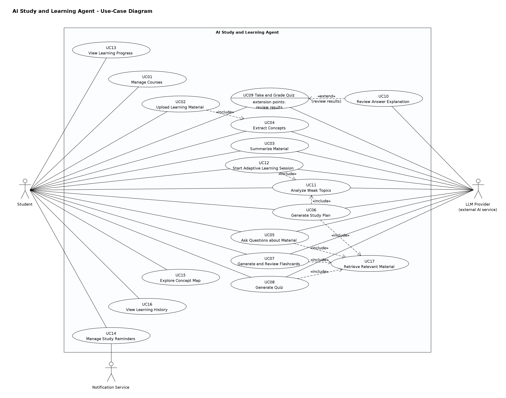

# Use-Case Model and Descriptions

*AI Study and Learning Agent - EECS 3311 Fall 2026 Stage 1. Extracted from [Stage1_Report.md](Stage1_Report.md); diagrams are in [`img/`](img/) and the UMLet sources in [`../diagrams/umlet/`](../diagrams/umlet/).*

## 6. Use-Case Model

### 6.1 Actors

| Actor | Type | Description |
|---|---|---|
| **Student** | Primary, human | Initiates every use case through the GUI or CLI. |
| **LLM Provider** | Secondary, external system | The external AI service (Gemini or OpenAI API) that performs language generation and embedding. It is outside the system boundary - the system only owns the `LLMClient` adapters that talk to it. Connected to every use case whose main scenario requires generation. |
| **Notification Service** | Secondary, external system | Operating-system notification centre that displays reminders. Connected to UC14. |

**Actors deliberately excluded.** An *Administrator* is not included because the system is a personal, single-user study tool with no shared data to administer; inventing one would add use cases without requirements. *Document storage* and the *database* are internal to the system (persistence layer), so they are not actors. Time-triggered reminder dispatch is modelled inside UC14 rather than with a separate "Clock" actor.

### 6.2 Use-Case Diagram

*Figure 7. Use-case diagram (`01-use-case.uxf`).*

**Relationships and justification**

- `UC02 Upload Learning Material` **«include»** `UC04 Extract Concepts`: upload is not complete until the material's concepts are known, because every personalised feature works at concept level. UC04 can also be run on its own (re-extraction).
- `UC05`, `UC06`, `UC07`, `UC08` **«include»** `UC17 Retrieve Relevant Material`: four use cases share the same mandatory retrieval behaviour; including it avoids repeating it in four descriptions. UC17 is not a student goal by itself, so it has no actor association.
- `UC06 Generate Study Plan` and `UC12 Start Adaptive Learning Session` **«include»** `UC11 Analyze Weak Topics`: both cannot proceed without knowing the weak topics.
- `UC10 Review Answer Explanation` **«extend»** `UC09 Take and Grade Quiz` at the extension point *review results*: explanations are optional; UC09 is complete without them.
- No use-case generalization is used because no use case is a specialised variant of another.

### 6.3 Detailed Use Cases

#### UC01 - Manage Courses
- **Primary actor:** Student. **Supporting actors:** none. **Related features:** F01.
- **Goal:** Create, view, update or delete a course.
- **Preconditions:** Application running; student profile exists.
- **Trigger:** Student selects "New Course" (or edit/delete) in *Courses*, or runs `study course ...`.
- **Main success scenario (create):** 1. Student enters code, title and optional exam date. 2. System validates that the code is unique for the student and the exam date is not in the past. 3. System creates and stores the course. 4. System records a `COURSE_CREATED` event. 5. System shows the course in the list.
- **Alternative flows:** A1 *Update*: student edits fields; steps 2-5 with an update. A2 *Delete*: system asks for confirmation, then deletes the course and everything it owns (materials, chunks and their vectors, concepts, plans, quizzes, decks).
- **Exception flows:** E1 Duplicate code → error, nothing stored. E2 Exam date in the past → error.
- **Postconditions:** Course list reflects the change.

#### UC02 - Upload Learning Material
- **Primary actor:** Student. **Supporting actors:** LLM Provider (embeddings; concept extraction via UC04). **Related features:** F02 (and F04 via include).
- **Goal:** Make a course file available for AI-supported learning.
- **Preconditions:** Course exists.
- **Trigger:** Student clicks "Upload" or runs `study material upload`.
- **Main success scenario:** 1. Student selects a file. 2. System finds a parser that supports the file type. 3. System extracts the text. 4. System splits it into chunks, embeds and indexes them. 5. System marks the material `INDEXED` and stores it. 6. **Include UC04** (extract concepts). 7. System shows the material and its concepts.
- **Alternative flows:** A1 Student deletes a material: system removes it, its chunks, vectors and summary.
- **Exception flows:** E1 Unsupported type → error listing supported types; nothing stored. E2 No readable text → material stored as `FAILED` with reason; student told to upload a text-based version. E3 Embedding service unavailable → material stays `UPLOADED`; indexing retried.
- **Postconditions:** Material is searchable by retrieval; concepts updated.

#### UC03 - Summarize Material
- **Primary actor:** Student. **Supporting actors:** LLM Provider. **Related features:** F03.
- **Goal:** Obtain a summary of one material.
- **Preconditions:** Material is `INDEXED`.
- **Trigger:** "Summarize" in *Course Materials* or `study material summarize`.
- **Main success scenario:** 1. Student selects material and length. 2. System loads the material's chunks. 3. Agent plans single-pass or map-reduce summarisation. 4. Agent summarises sections and combines them. 5. System validates the output, stores and displays the summary with page references.
- **Alternative flows:** A1 A summary already exists → shown immediately with "Regenerate" option.
- **Exception flows:** E1 Material not found. E2 Material not processed (unsupported/failed) → explanatory error. E3 LLM failure → "try again later"; nothing stored.
- **Postconditions:** Summary stored; event recorded.

#### UC04 - Extract Concepts
- **Primary actor:** Student (directly, or via UC02). **Supporting actors:** LLM Provider. **Related features:** F04, F15.
- **Goal:** Identify the concepts and concept relations in a material.
- **Preconditions:** Material is `INDEXED`.
- **Trigger:** Included by UC02, or "Re-extract concepts" / `study material extract-concepts`.
- **Main success scenario:** 1. Agent sends chunk batches to the concept extraction tool. 2. LLM returns concepts and relations. 3. System validates them (drops relations to unknown concepts). 4. System merges concepts into the course set by normalised name and stores relations. 5. Concepts are shown under the material.
- **Exception flows:** E1 LLM unavailable/invalid output → warning; material remains usable; student may retry.
- **Postconditions:** Course concept graph updated without duplicates.

#### UC05 - Ask Questions about Material
- **Primary actor:** Student. **Supporting actors:** LLM Provider. **Related features:** F05.
- **Goal:** Get a correct, source-cited answer to a course question.
- **Preconditions:** Course selected.
- **Trigger:** Student sends a question in *AI Tutor* or runs `study ask`.
- **Main success scenario:** 1. Student submits a question. 2. Agent reads recent conversation turns. 3. Agent plans retrieval + answer. 4. **Include UC17**. 5. Agent builds a prompt restricted to the retrieved sources and generates the answer. 6. System checks grounding. 7. System displays the answer with citations and stores the turn and event.
- **Alternative flows:** A1 Follow-up question → session memory resolves references (e.g. "what about interfaces?").
- **Exception flows:** E1 No relevant material → system says so without calling the LLM, offers to upload material or give a labelled general explanation. E2 Answer not grounded → one stricter regeneration, then answer flagged. E3 LLM unavailable → error; question kept.
- **Postconditions:** Session memory and history updated.

#### UC06 - Generate Study Plan
- **Primary actor:** Student. **Supporting actors:** LLM Provider. **Related features:** F06, F11.
- **Goal:** Obtain a personalised day-by-day plan until the exam.
- **Preconditions:** Course exists.
- **Trigger:** "Generate Plan" or `study study-plan generate`.
- **Main success scenario:** 1. Student enters exam date, daily minutes and optional focus topics. 2. System validates input. 3. Agent loads learner context. 4. **Include UC11** (weak topics). 5. **Include UC17** (retrieve material for weak and focus topics). 6. Agent reasons about priorities and objectives (LLM) and validates the result. 7. Agent selects a scheduling strategy and builds tasks. 8. If reminders are enabled, agent schedules task reminders. 9. System stores the plan (archiving the previous one) and displays it with its rationale.
- **Alternative flows:** A1 Student marks a task complete → completion rate updated. A2 Mastery changes significantly later → system revises the plan automatically (SD04) and notifies the student.
- **Exception flows:** E1 Invalid input → validation error. E2 No relevant material → plan generated from concept names, with a warning. E3 LLM output invalid after retry → deterministic priorities used. E4 Too little time → lowest-priority topics reported as not scheduled.
- **Postconditions:** One active plan per course; event recorded.

#### UC07 - Generate and Review Flashcards
- **Primary actor:** Student. **Supporting actors:** LLM Provider. **Related features:** F07, F13.
- **Goal:** Create and review flashcards for selected topics.
- **Preconditions:** Course with indexed material.
- **Trigger:** "Generate" in *Flashcards* or `study flashcards generate`.
- **Main success scenario:** 1. Student chooses topics and number of cards. 2. **Include UC17**. 3. Agent generates card pairs. 4. System removes empty/duplicate cards and stores the deck. 5. Student reviews cards and rates each. 6. System updates each card's Leitner box and next review date and records the result as mastery evidence.
- **Exception flows:** E1 No material for topic → error. E2 Fewer valid cards than requested → deck created with the valid cards and shortfall reported. E3 CLI syntax error → usage help.
- **Postconditions:** Deck stored; review schedule and mastery updated.

#### UC08 - Generate Quiz
- **Primary actor:** Student. **Supporting actors:** LLM Provider. **Related features:** F08.
- **Goal:** Get a quiz on chosen concepts at a chosen difficulty.
- **Preconditions:** Course has concepts and indexed material.
- **Trigger:** "Generate Quiz" or `study quiz generate`.
- **Main success scenario:** 1. Student chooses concepts, count, types and difficulty. 2. **Include UC17**. 3. Agent generates question specifications. 4. Each specification is validated and turned into a typed question by its factory. 5. System stores and displays the quiz.
- **Exception flows:** E1 Invalid specifications → replacement round (max 2). E2 Still short → smaller quiz with notice. E3 LLM unavailable → error.
- **Postconditions:** Quiz stored.

#### UC09 - Take and Grade Quiz
- **Primary actor:** Student. **Supporting actors:** LLM Provider (short answers only). **Related features:** F09, F13.
- **Goal:** Submit answers and receive a score.
- **Preconditions:** Quiz exists.
- **Trigger:** "Submit" in *Quiz Center* or finishing `study quiz take`.
- **Extension point:** *review results* (after step 5).
- **Main success scenario:** 1. Student answers and submits. 2. System grades objective questions exactly. 3. System grades short answers against the rubric using the LLM. 4. System computes the score and stores the attempt. 5. System updates performance records and concept mastery and notifies observers. 6. System displays results.
- **Exception flows:** E1 Unanswered questions → 0 for those. E2 LLM unavailable → short answers flagged "needs review" and excluded from mastery.
- **Postconditions:** Attempt stored; mastery updated; dashboard, plan monitor and reminder scheduler notified.

#### UC10 - Review Answer Explanation
- **Primary actor:** Student. **Supporting actors:** LLM Provider. **Related features:** F10.
- **Goal:** Understand why an answer is right or wrong.
- **Preconditions:** A graded attempt exists. **Extends** UC09 at *review results*.
- **Trigger:** "Explain" next to a question.
- **Main success scenario:** 1. Student selects a question. 2. System loads the question and the student's response. 3. Agent retrieves related material. 4. Agent generates an explanation referencing the material. 5. System displays it.
- **Exception flows:** E1 No relevant source → explanation from the model answer, labelled not source-backed. E2 LLM unavailable → correct answer shown without explanation.
- **Postconditions:** None persistent.

#### UC11 - Analyze Weak Topics
- **Primary actor:** Student (directly or via UC06/UC12). **Supporting actors:** LLM Provider. **Related features:** F11.
- **Goal:** Know which concepts are weakest and why.
- **Preconditions:** Course exists.
- **Trigger:** "Weak Topics" panel, `study weak-topics show`, or inclusion.
- **Main success scenario:** 1. System ranks concepts by mastery, recency and prerequisite weight. 2. For the weakest concepts, agent retrieves material and the student's wrong answers. 3. Agent diagnoses likely misconceptions and recommends activities. 4. System displays the report.
- **Exception flows:** E1 Insufficient data (< 5 graded attempts) → recommend diagnostic quiz. E2 LLM failure → ranking without diagnosis.
- **Postconditions:** Event recorded.

#### UC12 - Start Adaptive Learning Session
- **Primary actor:** Student. **Supporting actors:** LLM Provider. **Related features:** F12, F13, F06 (revision).
- **Goal:** Practise with activities whose difficulty and topic adapt to performance.
- **Preconditions:** Course has concepts and indexed material.
- **Trigger:** "Start session" or `study learning-session start`.
- **Main success scenario:** 1. System creates a session with an initial difficulty state derived from mastery. 2. **Include UC11** to select the target concept. 3. Agent generates an activity at the current level. 4. Student answers. 5. System grades, updates mastery and notifies observers (the plan may be revised). 6. The difficulty state transitions if its rule is met. 7. Steps 3-6 repeat until the student ends the session. 8. System records the session.
- **Exception flows:** E1 LLM unavailable → reuse stored questions at that level; otherwise end gracefully. E2 All concepts mastered → suggest mixed review.
- **Postconditions:** Mastery and history updated.

#### UC13 - View Learning Progress
- **Primary actor:** Student. **Related features:** F13.
- **Goal:** See current readiness.
- **Preconditions:** Course exists.
- **Trigger:** Open *Progress Dashboard* or `study progress show`.
- **Main success scenario:** 1. System loads mastery and performance records. 2. System computes derived progress values. 3. System displays charts; the view stays subscribed and refreshes when progress changes.
- **Exception flows:** E1 No data → empty state with suggestion.
- **Postconditions:** None.

#### UC14 - Manage Study Reminders
- **Primary actor:** Student. **Supporting actors:** Notification Service. **Related features:** F14.
- **Goal:** Be reminded to study at the right time.
- **Preconditions:** None.
- **Trigger:** Create/cancel in *Reminders* or `study reminder ...`; time reaching a reminder's due time.
- **Main success scenario:** 1. Student creates a reminder (message, time, recurrence). 2. System validates and stores it. 3. When due, system sends it to the Notification Service. 4. System marks it sent or computes the next occurrence.
- **Alternative flows:** A1 Student cancels a reminder. A2 System creates a reminder automatically (plan tasks via the agent; sharp mastery drop via the observer).
- **Exception flows:** E1 Past due time → rejected. E2 Delivery failure → retried next minute. E3 App closed at due time → delivered on next start.
- **Postconditions:** Reminder stored/updated.

#### UC15 - Explore Concept Map
- **Primary actor:** Student. **Related features:** F15.
- **Goal:** Understand how concepts relate and where weaknesses are.
- **Preconditions:** Concepts extracted.
- **Trigger:** Open *Concept Map* or `study concept-map show`.
- **Main success scenario:** 1. System loads concepts, relations and mastery. 2. System builds and displays a mastery-coloured graph. 3. Student selects a concept; system shows prerequisites and related concepts. 4. Optionally the student starts a quiz on it (UC08).
- **Exception flows:** E1 No concepts → empty state with guidance.
- **Postconditions:** None.

#### UC16 - View Learning History
- **Primary actor:** Student. **Related features:** F16.
- **Goal:** Review past learning activity.
- **Preconditions:** None.
- **Trigger:** Open *Learning History* or `study history show`.
- **Main success scenario:** 1. Student sets filters (course, period, type). 2. System retrieves matching events. 3. System displays them chronologically with links to related objects.
- **Exception flows:** E1 No events → "no activity" message.
- **Postconditions:** None.

#### UC17 - Retrieve Relevant Material (included use case)
- **Primary actor:** none (included by UC05, UC06, UC07, UC08). **Related features:** F05, F06, F07, F08.
- **Goal:** Provide the most relevant chunks of the student's material for a query.
- **Preconditions:** Course selected.
- **Main success scenario:** 1. Query is embedded. 2. Vector store returns the top-k chunks for the course. 3. Chunks below the relevance threshold are discarded. 4. Remaining chunks are returned with scores and source references.
- **Exception flows:** E1 No chunk above threshold → empty result; the including use case applies its own alternative flow.
- **Postconditions:** None.
